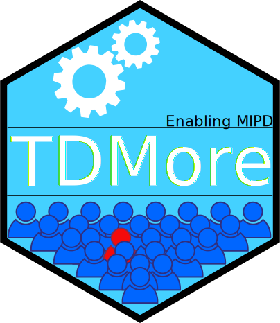

# tdmore 

<!-- badges: start -->
[](https://www.tidyverse.org/lifecycle/#experimental)
[](https://cran.r-project.org/package=tdmore)
[](https://travis-ci.com/tdmore-dev/tdmore)
[](https://codecov.io/gh/tdmore-dev/tdmore)
<!-- badges: end -->

`tdmore` is a research tool to investigate precision dosing. 
It provides an easy interface to perform bayesian fit of
a virtual population, using a user-provided population model,
and allows to explore new dosing regimen for this population. One of these
dosing regimen can be implemented as precision dosing, allowing you to compare performance versus classical techniques. Learn more in `vignette("tdmore")` or
`?tdmore`.

## Installation

``` r
# Install development version from GitHub
devtools::install_github("tdmore-dev/tdmore")
```

## How to use

Please refer to the articles in the pkgdown site.
