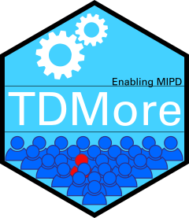

 

# tdmore 

`tdmore` provides an easy interface for the execution of post-hoc bayesian
estimation of parameter vectors of virtual individuals given a population model and for the in silico assessment of dose individualization strategies.

The package is intended to make it easy to define your own models and use them for in silico assessments and educational purposes.

# License

This project does not include a license. This means that all work is
under exclusive copyright. Nobody else can use, copy, distribute or
modify this work.

The Github terms of service apply. We allow others to view and fork the
repository. Please note that this is not sufficient to then copy,
distribute or modify this work further.

Please see <https://choosealicense.com/no-permission/> for more
information.

Through publishing, we allow others to use this R package and to perform
in silico evaluation of individualized dosing strategies. Under no circumstances
should the software in its current state be used for patient care.
Installing this package using
`devtools::install_github` is allowed.

The official copyright holder of this work is the KU Leuven university.

# Limitations

This software is a research project, and cannot be considered as a
medical device.

# Contribution guidelines
Currently, the license does not allow to modify the code any further. Once this changes, refer to the below for contribution.

Please find the contribution guidelines <a href="CONTRIBUTING.html">here</a>. This document also contains some technical documentation. To make contributions to this project, you will need to sign a transfer of copyright statement. Please find it <a href="TODO">here</a>.
