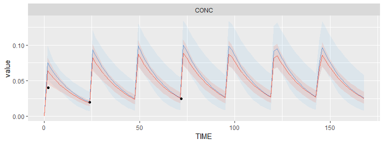

<!-- README.md is generated from README.Rmd. Please edit that file -->
<a href="https://travis-ci.com/tdmore-dev/tdmore">  </a> <a href="https://codecov.io/gh/tdmore-dev/tdmore">  </a>

TDMore 
==================================================================

`tdmore` provides an easy interface to execute post-hoc bayesian estimation of individual profiles, and to find the best dose to put the patient on target.

The package is intended to make it easy to define your own models, and easily create a dose decision support tool for physicians.

License
=======

This project does not include a license. This means that all work is under exclusive copyright. Nobody else can use, copy, distribute or modify this work.

The Github terms of service apply. We allow others to view and fork the repository. Please note that this is not sufficient to then copy, distribute or modify this work further.

Please see <https://choosealicense.com/no-permission/> for more information.

Through publishing, we allow others to use this R package and to perform dose adaptation. Installing this package using `devtools::install_github` is allowed.

The official copyright holder of this work is the KU Leuven university.

Limitations
===========

This software is a research project, and cannot be considered as a medical device. It is not a substitute for clinical reasoning.

How to install
==============

TDMore depends on package `RxODE`, which requires a working C and fortran compiler to work. Installation procedure can be found [here](https://github.com/nlmixrdevelopment/RxODE). Once `RxODE` installed, simply execute the following command in the R console:

``` r
devtools::install_github("tdmore-dev/tdmore")
```

If you would like to install the package with all its vignettes, please run the following command instead:

``` r
devtools::install_github("tdmore-dev/tdmore", build_vignettes = TRUE)
```

Note that these vignettes can also be browsed on the [TDMore bookdown](https://tdmore-dev.github.io/tdmore).

How to use
==========

This example code uses `nlmixr` to define the model.

``` r
library(nlmixr)
library(tdmore)

modelCode <- function(){
  ini({
    TVKA <- 3.7
    TVVc <- 61
    TVCL <- 3.7
    ECL ~ 0.0784 #OMEGA_CL, 28% SD
    EV1 ~ 0.0361 #OMEGA_V1, 19% SD
    EPS_PROP <- 0.23 # Proportional error, 23% SD
  })
  model({
    KA <- TVKA
    CL <- TVCL * exp(ECL)
    Vc <- TVVc * exp(EV1)
    
    d/dt(depot) = -KA*depot
    d/dt(center) = KA*depot - CL/Vc * center
    
    CONC = center / Vc
    CONC ~ prop(EPS_PROP)
  })
}
model <- nlmixr::nlmixrUI(modelCode) %>% tdmore()

regimen <- data.frame(
  TIME=seq(0, 7)*24,
  AMT=5 #5mg
)

observed <- data.frame(TIME=c(2, 24, 72), CONC=c(0.04, 0.02, 0.025))
ipred <- model %>% estimate(observed, regimen)
```

``` r
plot(ipred)
```



``` r
coef(ipred)
```

    ##        ECL        EV1 
    ## 0.07919094 0.16336159

``` r
vcov(ipred)
```

    ##             ECL         EV1
    ## ECL 0.011750224 0.009337667
    ## EV1 0.009337667 0.030952575

More information
================

Interested in TDMore and eager to learn more about it? Visit our bookdown by clicking [here](https://tdmore-dev.github.io/tdmore). The bookdown also contains the R [vignettes](https://tdmore-dev.github.io/tdmore/vignettes.html). These are great examples to start with.
