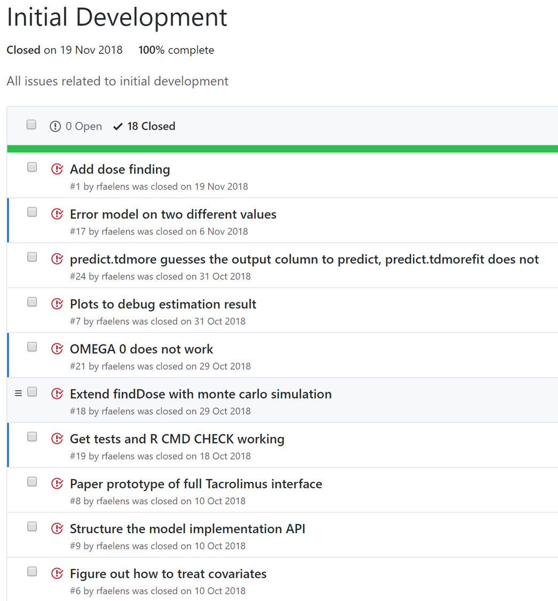

# Validation  {#validation}
This section details the development process for TDMore. It also shows the validation (in a Computer Systems Validation GxP-sense,
explicitly not in a clinical sense) that was performed. Finally, it hints at the requirements should you decide to develop this tool for in silico simulation and teaching into a in your dose adaptation software incorporating the TDMore engine on your own account (we explicitly discourage the use of the software provided for clinical purposes and deny any responsibility for it).

## Development process
TDMore is developed as an R package. The development team tries their best to adhere to international standards such as `IEC 62304:2006`. This ensures that the software is developed to the highest quality standards.

New features are first described in a Github ticket. They are discussed between the development team and prioritized.

The feature is then developed. The API is documented through Roxygen2, and its use is documented in a vignette or in the documentation book. Automated tests are written for every new feature. It is our intention to get code coverage of critical parts up to 100%.

A continuous integration infrastructure is in place. GIT commit hooks ensure that all documentation is up-to-date at every commit. A push triggers automated testing in Travis. Furthermore, a Docker image is automatically built at every commit, and automated testing on the docker image is also performed. This ensures a stable environment to build on.

## Standards: IEC 62304:2006
*It should be stressed that TDMore is not a medical device.* The software is for research and educational use only, and should never be directly used in patient care.

The IEC 62304:2006 standard defines several requirements, some general and some specific to the development process. General requirements include Quality Management (ISO 13485), Risk Management (ISO 14971) and Software Safety Classification. These are not considered by the TDMore development team, as TDMore is not a medical device and clinical use is effectively discouraged by the developers.

For Software Development, the standard requires *Software development planning* (Class A, B and C). This is implemented in TDMore in the Github repository issue tracker. Issues describe features or bugs that are developed. They are grouped together in milestones. The software plan is regularly updated, as can be shown by the github activity tracker.

However, this software is developed as open-source software. In that sense, it is not subject to clear planning. Instead, milestones are delivered as they come, and all standard software development processes apply to these releases.

The standard requires *Software requirements analysis*. For TDMore, this consists of a thorough description of the intended feature in the ticket. In some cases, example code is added.

*Software architectural design* is largely ad-hoc. There is no specific design role or stage. This should not be deemed problematic, as TDMore is not a large software with plenty of layers.

*Software detailed design* can be considered an essential part of feature implementation. TDMore is not clinical user facing, but is built as an R package, to be consumed by developers and/or pharmacometricians for in silico work. APIs are carefully designed.

*Unit implementation and verification* is done using RStudio and the GIT version control system. Peer review is used to verify all code committed. Automated tests are used to verify features function as expected.

For now, no formal releases have been executed. It is our intent to release to CRAN regularly, starting september 2019.

## Validation requirements
*It should be stressed that TDMore is not a medical device.* The software is for research and educational use only, and should never be directly used in patient care without an extensive validation process, for which you and only you are responsible.

Should you wish to build a dose adaptation tool, and include the TDMore mathematical engine, please note that we deny any responsibility and that any dose adaptation tool is classified as a Medical Device under [MEDDEV July 2016](https://ec.europa.eu/docsroom/documents/17921/attachments/1/translations/en/renditions/native).

> [page 20] Drug (e.g.: Chemotherapy) planning systems are intended to calculate the drug dosage to be administered to a specific patient and therefore are qualified as medical devices.

Marketing such a tool for routine clinical use would indeed be subject to a CE-approval. A useful framework for the validation of such a tool could be found in [FDA Guidance on Software as a Medical Device](https://www.fda.gov/medical-devices/digital-health/software-medical-device-samd).

As described in the figure, the validation process can be viewed in 3 parts:

### Valid Clinical Association

> Is there a valid clinical association between the SaMD output and your SaMD’s targeted clinical condition?

In the case of dose adaptation, you should show a valid association between the PK or PD target and actual clinical outcome. This can be shown on the basis of historical data, as long as the method of drug administration remains similar, and as long as it is causative.

### Analytical Validation

> Does your SaMD correctly process input data to generate accurate, reliable, and precise output data?

Although TDMore has been carefully validated to ensure valid results (within the limitations of the EBE or MPC estimation technique), that does not mean your model predicts individual outcomes accurately or precisely. A prospective evaluation should be performed, ideally on real data. This can be compared to physician performance in hitting the target.

### Clinical Validation

> Does use of your SaMD’s accurate, reliable, and precise output data achieve your intended purpose in your target population in the context of clinical care?

This requirement alludes to a prospective clinical trial. In this trial, you should show use of the software results in superior outcomes as compared to current practices. We strongly recommend to perform an `in silico` study first, at least to determine sample size.

### Other requirements
More streneous requirements may also be needed, including but not limited to:

- Server hosting, reliability and data privacy
- Robustness to data entry errors
- Robustness to outliers, e.g. heavily overweight patients
- Robustness to different assays used (e.g. LC/MS-MS vs immuno-assay)
- Protection against hackers or DoS attacks
- Maintenance and support

In essence, if you want to build software geared towards clinical application based on TDMore, we deny any responsibility and suggest you to contact a lawyer, a Medical Device expert, and/or your local regulatory authority.
