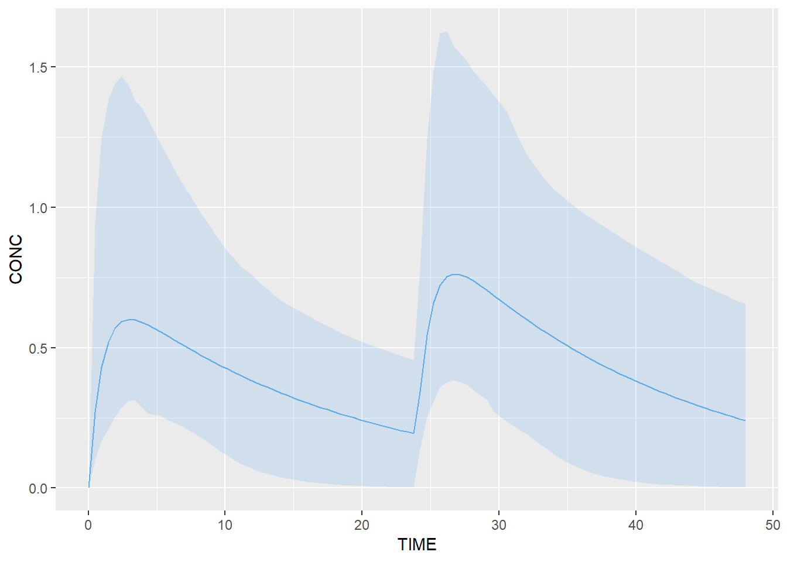
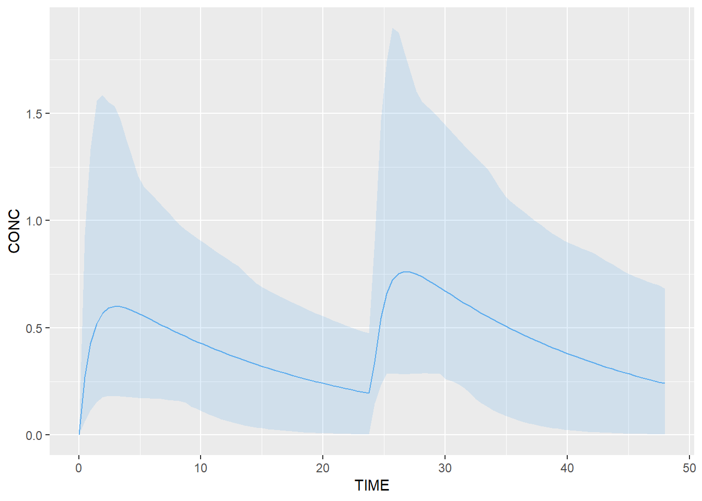
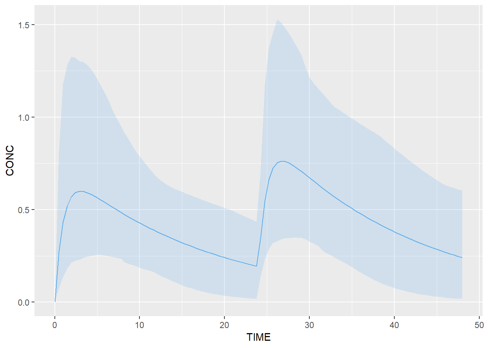

# TDMore API

The following section shows an overview of the main methods from the TDMore API and tells you how to use them.

## Model definition

The TDMore model can be built using 3 different ways. Its model definition can be:

- a [`nlmixr`](https://cran.r-project.org/package=nlmixr) model
- a [`RxODE`](https://cran.r-project.org/package=RxODE) model
- a custom algebraic model

These 3 ways will be explained in the next sections.

### Build a TDMore object from a nlxmir model
Let's implement a basic 1-compartment PK model in `nlmixr`. The model code is divided in two different blocks. The 'ini' block is used to define all the model parameter values (commonly called theta's, omega's and sigma's in PK/PD modelling language) while the 'model' blocks defines all the equations of the model.
The `nlmixr` function is implemented as follows:


```r
modelCode1 <- function() {
  ini({
    TVKA <- 1 # THETA on KA
    TVV <- 70 # THETA on V
    TVCL <- 4 # THETA on CL
    
    EKA ~ 0.3 # ETA on KA (OMEGA, variance)
    EV ~ 0.3  # ETA on V (OMEGA, variance)
    ECL ~ 0.3 # ETA on CL (OMEGA, variance)
    
    SIGMA <- 0.1 # 10% CV proportional error
  })
  model({
    KA <- TVKA*exp(EKA)
    V <- TVV*exp(EV)
    CL <- TVCL*exp(ECL)

    d/dt(depot) = -KA*depot
    d/dt(center) = KA*depot - CL/V*center

    CONC = center/V
    CONC ~ prop(SIGMA)
  })
}
```

A TDMore object can then be instantiated by running the following snippet:


```r
library(tdmore)
library(nlmixr)
tdmore1 <- nlmixrUI(modelCode1) %>% tdmore()
```

Your model is ready to use. Have a look at the content by calling:


```r
summary(tdmore1)
```

```
## Structural model: RxODE 
## 
## Parameters:
##  name var        cv
##   EKA 0.3 0.5477226
##    EV 0.3 0.5477226
##   ECL 0.3 0.5477226
## 
## Covariates: / 
## 
## Residual error model:
##  name additiveError proportionalError exponentialError
##  CONC             0               0.1                0
```

This summary tells you the model contains 3 parameters: EKA, EV and ECL. These parameters will be estimated by TDMore to fit individual observations as best as possible. The model does not have any covariates (to see how covariates are included, go to section X). Output variable is the 'CONC' variable. The residual error model on this variable is proportional. Please note that the underlying structural model is `RxODE`, not `nlxmir`. This is because the `nlxmir` model is automatically converted into a RxODE model. The `RxODE` package is used extensively in TDMore to simulate data. 

### Build a TDMore object from an RxODE model

The same TDMore object can be based on a `RxODE` model as well. This is done as follows:


```r
modelCode2 <- "
  TVKA = 1
  TVV = 70
  TVCL = 4
  KA <- TVKA * exp(EKA)
  V <- TVV * exp(EV)
  CL <- TVCL * exp(ECL)
  d/dt(depot) = -KA*depot
  d/dt(center) = KA*depot - CL/V*center
  CONC = center/V
"
```

Note that the model is a character vector and not a function anymore. It does not include the ETA's (and related OMEGA values). Furthemore, the residual error model is omitted. The missing information needs to be passed to TDMore as follows (arguments `omega` and `res_var`):


```r
library(tdmore)
library(RxODE)
omegaMatrix <- vectorToDiagonalMatrix(c(EKA=0.3, EV=0.3, ECL=0.3))
errorModel <- errorModel("CONC", prop=0.1)
tdmore2 <- RxODE(modelCode2) %>% tdmore(omega=omegaMatrix, res_var=list(errorModel))
```

The omega matrix is a 3x3 matrix. Only the diagonal is used as you can see. However, correlations can be added if needed.
Your model is now ready to use. It can be summarised this way:


```r
summary(tdmore2)
```

```
## Structural model: RxODE 
## 
## Parameters:
##  name var        cv
##   EKA 0.3 0.5477226
##    EV 0.3 0.5477226
##   ECL 0.3 0.5477226
## 
## Covariates: / 
## 
## Residual error model:
##  name additiveError proportionalError exponentialError
##  CONC             0               0.1                0
```

This summary is the exact same copy as the previous one!

### Build your own algebraic model
Finally, `TDMore` can also work with algebraic models. To do so, the model definition function must return a object of class `algebraic_definition`. In particular, it must override the `predictFunction(times, regimen, ...)` which returns the output variable according to the `times` vector and specified `regimen`. The following code shows how the algebraic model can be implemented:


```r
modelCode3 <- function(THETA=list(KA=1, V=70, CL=4), OMEGA=list(KA=0.3, V=0.3, CL=0.3)) {
  return(structure(list(
    predictFunction = function(times, regimen, EKA, EV, ECL) {
      V = THETA$V * exp(EV)
      CL = THETA$CL * exp(ECL)
      KA = THETA$KA * exp(EKA)
      k = CL / V
      t = times
      
      CONC <- rep(0, length(times))
      for(i in seq(1, nrow(regimen))) { # Iterate over all regimen rows
        tD = regimen$TIME[i]
        D = regimen$AMT[i]
        II = regimen$II[i] # A number, 0, or NULL
        if(!is.null(II) && II > 0) { # Keep repeating the dose until we are past the last observation time
          nbrDoses <- row$ADDL
          while(tD <= max(t) && nbrDoses > 0) {
            CONC <- CONC + ifelse(t >= tD, D/V * (KA/(KA-k)) * (exp(-k*(t-tD)) - exp(-KA*(t-tD))), 0) # Algebraic solution of 1-cpt-model
            tD <- tD + II
            nbrDoses <- nbrDoses - 1
          }
        } else {
          # Single administration
          CONC <- CONC + ifelse(t >= tD, D/V * (KA/(KA-k)) * (exp(-k*(t-tD)) - exp(-KA*(t-tD))), 0) # Algebraic solution of 1-cpt-model
        }
      }
      return(CONC)
    },
    omega = vectorToDiagonalMatrix(list(EKA=OMEGA$KA, EV=OMEGA$V, ECL=OMEGA$CL))),
    class = "algebraic_definition"))
}
```

The algebraic function definition needs to be passed to the `algebraic` function. This creates an `algebraic` model compatible with TDMore.


```r
library(tdmore)
errorModel <- errorModel("CONC", prop=0.1)
tdmore3 <- algebraic(modelCode3()) %>% tdmore(res_var=list(errorModel))
```


```r
summary(tdmore3)
```

```
## Structural model: algebraic 
## 
## Parameters:
##  name var        cv
##   EKA 0.3 0.5477226
##    EV 0.3 0.5477226
##   ECL 0.3 0.5477226
## 
## Covariates: / 
## 
## Residual error model:
##  name additiveError proportionalError exponentialError
##  CONC             0               0.1                0
```
### Add covariates to the model

## Regimen object


```r
regimen <- data.frame(TIME=c(0,24,48), AMT=c(50,50,0))
```

## Simulation a model


```r
plot(tdmore1, regimen=regimen)
```



```r
plot(tdmore2, regimen=regimen)
```



```r
plot(tdmore3, regimen=regimen)
```



## Parameter estimation

## Dose recommendation

## Plotting the intermediate steps

## Extending TDMore
