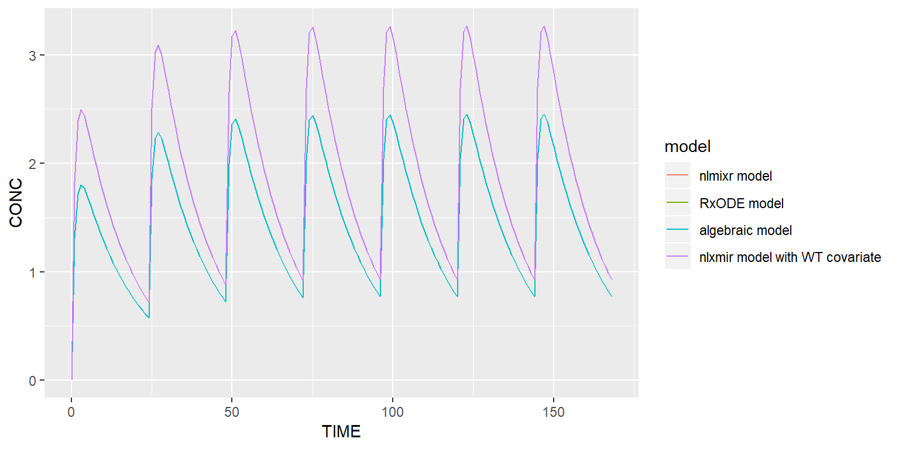
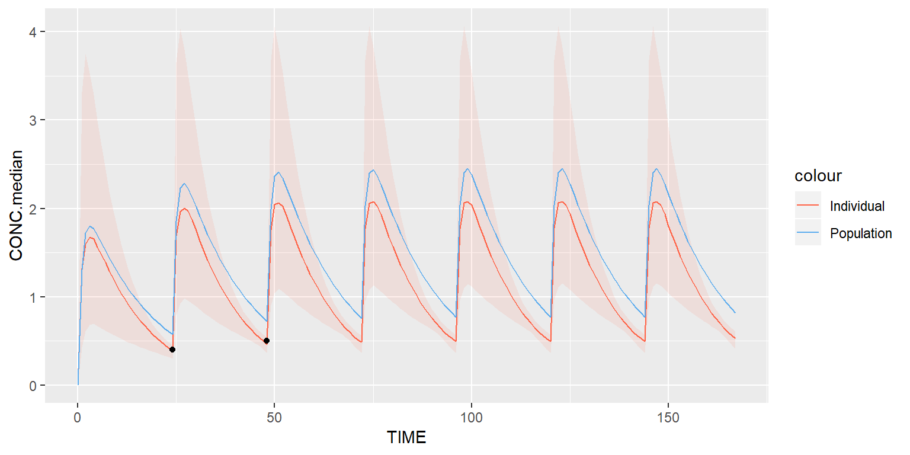
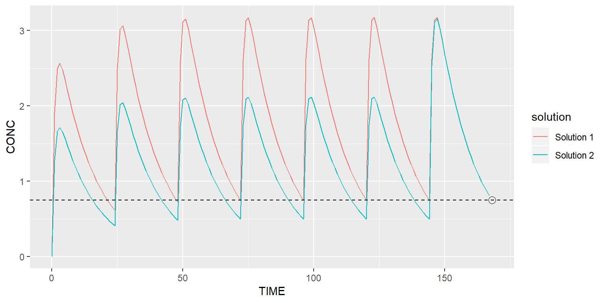
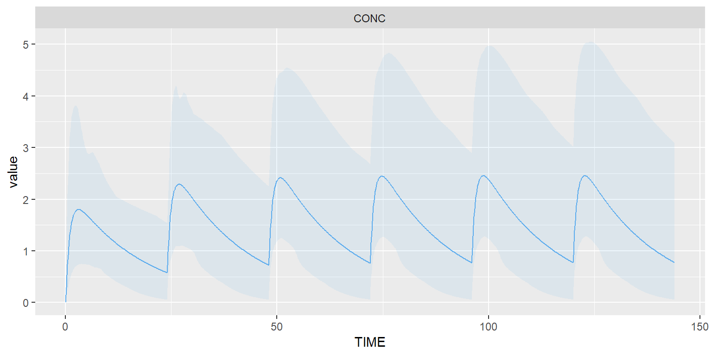
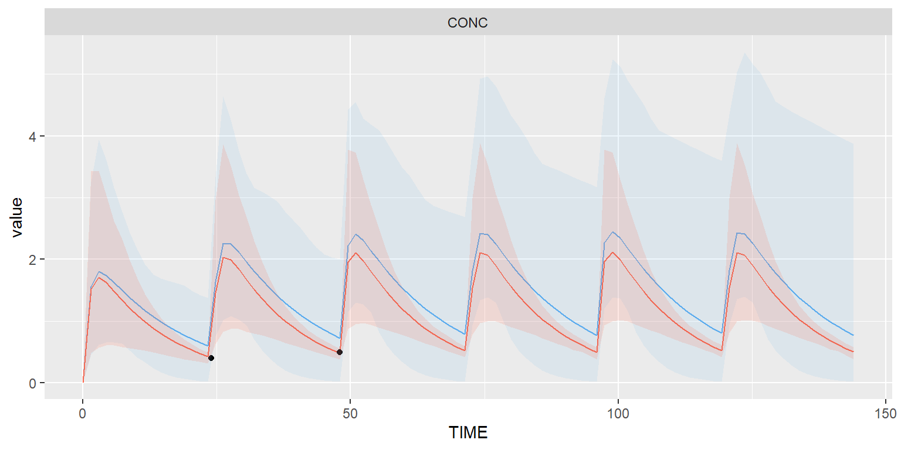
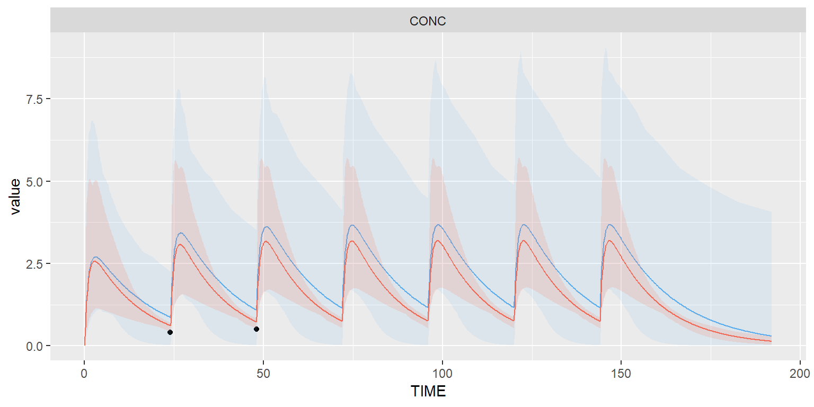
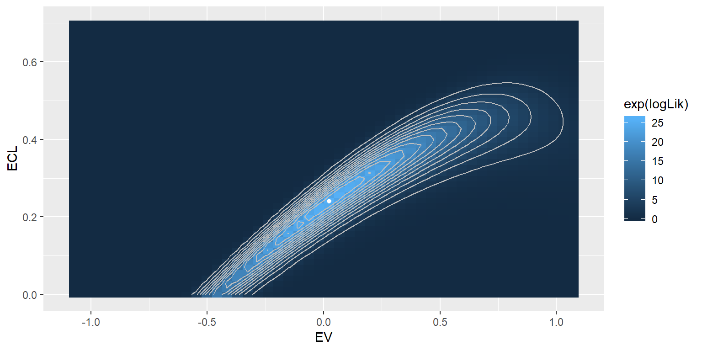

# TDMore API

The following section shows an overview of the main methods of the TDMore API and tells you how to use them.

## Model definition {#model}

The TDMore model can be built using 3 different ways. Its model definition can be:

- a [`nlmixr`](https://cran.r-project.org/package=nlmixr) model
- a [`RxODE`](https://cran.r-project.org/package=RxODE) model
- a custom algebraic model

These 3 ways will be explained in the next sections.

### Build a TDMore object from a nlxmir model
Let's implement a basic 1-compartment PK model in `nlmixr`. The model code is divided in two different blocks. The 'ini' block is used to define all the model parameter values (commonly called theta's, omega's and sigma's in PK/PD modelling language) while the 'model' blocks defines all the equations of the model.
The `nlmixr` function is implemented as follows:


```r
library(nlmixr)
modelCode1 <- function() {
  ini({
    TVKA <- 1 # THETA on KA
    TVV <- 70 # THETA on V
    TVCL <- 4 # THETA on CL
    
    EKA ~ 0.3 # ETA on KA (OMEGA, variance)
    EV ~ 0.3  # ETA on V (OMEGA, variance)
    ECL ~ 0.3 # ETA on CL (OMEGA, variance)
    
    SIGMA <- 0.1 # 10% CV proportional error
  })
  model({
    KA <- TVKA*exp(EKA)
    V <- TVV*exp(EV)
    CL <- TVCL*exp(ECL)

    d/dt(depot) = -KA*depot
    d/dt(center) = KA*depot - CL/V*center

    CONC = center/V
    CONC ~ prop(SIGMA)
  })
}
```

A TDMore object can then be instantiated by running the following snippet:


```r
library(tdmore)
m1 <- nlmixrUI(modelCode1) %>% tdmore()
```

Your model is ready to use. Have a look at its content by calling:


```r
summary(m1)
```

```
## Structural model: RxODE 
## 
## Parameters:
##  name var        cv
##   EKA 0.3 0.5477226
##    EV 0.3 0.5477226
##   ECL 0.3 0.5477226
## 
## Covariates: / 
## 
## Residual error model:
##  name         type additiveError proportionalError
##  CONC proportional             0               0.1
```

This summary tells you the model contains 3 parameters: EKA, EV and ECL. These parameters will be estimated by TDMore to fit individual observations as best as possible. The model does not have any covariates (to see how covariates are included, go to section X). Output variable is the `CONC` variable. The residual error model on this variable is proportional. Please note that the underlying structural model is `RxODE`, not `nlxmir`. This is because the `nlxmir` model is automatically converted into a RxODE model. The `RxODE` package is used extensively in TDMore to simulate data. 

### Build a TDMore object from an RxODE model

The same TDMore object can be based on a `RxODE` model as well. This is done as follows:


```r
modelCode2 <- "
  TVKA = 1
  TVV = 70
  TVCL = 4
  KA <- TVKA * exp(EKA)
  V <- TVV * exp(EV)
  CL <- TVCL * exp(ECL)
  d/dt(depot) = -KA*depot
  d/dt(center) = KA*depot - CL/V*center
  CONC = center/V
"
```

Note that the model is a character vector and not a function anymore. It does not include the ETA's (and related OMEGA values). Furthemore, the residual error model is omitted. The missing information needs to be passed to TDMore as follows (arguments `omega` and `res_var`):


```r
library(tdmore)
library(RxODE)
errorModel <- errorModel("CONC", prop=0.1)
m2 <- RxODE(modelCode2) %>% tdmore(omega=c(EKA=0.3, EV=0.3, ECL=0.3), res_var=list(errorModel))
```

The omega matrix is a 3x3 matrix. Only the diagonal is used as you can see. However, correlations can be added if needed.
Your model is now ready to use. It can be summarised this way:


```r
summary(m2)
```

```
## Structural model: RxODE 
## 
## Parameters:
##  name var        cv
##   EKA 0.3 0.5477226
##    EV 0.3 0.5477226
##   ECL 0.3 0.5477226
## 
## Covariates: / 
## 
## Residual error model:
##  name         type additiveError proportionalError
##  CONC proportional             0               0.1
```

This summary is the exact same copy as the previous one!

### Build your own algebraic model
Finally, `TDMore` can also work with algebraic models. To do so, the model definition function must return a object of class `algebraic_definition`. In particular, it must override the `predictFunction(times, regimen, ...)` which returns the output variable according to the `times` vector and specified `regimen`. The following code shows how the algebraic model can be implemented:


```r
modelCode3 <- function(t, TIME, AMT, EKA, EV, ECL) {
      V = 70 * exp(EV)
      CL = 4 * exp(ECL)
      KA = 1 * exp(EKA)
      k = CL / V
      D = AMT
      tD = TIME
      # Algebraic solution of 1-cpt-model
      ifelse(t >= tD, D/V * (KA/(KA-k)) * (exp(-k*(t-tD)) - exp(-KA*(t-tD))), 0) 
    }
m3 <- tdmore(algebraic(modelCode3), 
       omega=c(EKA=0.3, EV=0.3, ECL=0.3),
       res_var=errorModel(prop=0.1)
       )
summary(m3)
```

```
## Structural model: algebraic 
## 
## Parameters:
##  name var        cv
##   EKA 0.3 0.5477226
##    EV 0.3 0.5477226
##   ECL 0.3 0.5477226
## 
## Covariates: / 
## 
## Residual error model:
##  name         type additiveError proportionalError
##  CONC proportional             0               0.1
```

### Add model covariates

Let's assume the weight is a covariate in the previous 1-compartment model. It can be added in the model as follows:


```r
modelCode1_WT <- function() {
  ini({
    TVKA <- 1 # THETA on KA
    TVV <- 70 # THETA on V
    TVCL <- 4 # THETA on CL
    
    EKA ~ 0.3 # ETA on KA (OMEGA, variance)
    EV ~ 0.3  # ETA on V (OMEGA, variance)
    ECL ~ 0.3 # ETA on CL (OMEGA, variance)
    
    SIGMA <- 0.1 # 10% CV proportional error
  })
  model({
    KA <- TVKA*exp(EKA)
    V <- TVV*(WT/70)*exp(EV)
    CL <- TVCL*((WT/70)**0.75)*exp(ECL)

    d/dt(depot) = -KA*depot
    d/dt(center) = KA*depot - CL/V*center

    CONC = center/V
    CONC ~ prop(SIGMA)
  })
}
```

Now, the TDMore object can be created and printed.


```r
library(tdmore)
library(nlmixr)
m1_WT <- nlmixrUI(modelCode1_WT) %>% tdmore()
```


```r
print(m1_WT) # Print may be seen as a short 'summary'
```

```
## Structural model: RxODE 
## Parameters: EKA EV ECL 
## Covariates: WT 
## Output(s):
## CONC  : proportional  ( prop= 0.1  )
```

Weight covariate has been well detected by TDMore!

## Regimen definition {#regimen}

The regimen definition in TDMore is relatively close to the NONMEM definition. In TDMore, the regimen is defined as a dataframe. Each row indicates a new dosing scheme. Supported column types are:

- TIME: time of first dose
- AMT: amount of the dose
- II (optional): dose interval between multiple doses
- ADDL (optional): additional doses, to be used in combination with II
- RATE (optional): defines the infusion time, if not specified, dose is a bolus given at once at t=`TIME`
- CMT (optional): the compartment number (1=depot, 2=center, 3=periph)

**Example 1**: the following snippet will give a 150mg dose every day for a week.


```r
regimen1 <- data.frame(TIME=0, AMT=150, II=24, ADDL=7)
```

This is strictly equivalent to the following form:


```r
regimen1 <- data.frame(TIME=c(0,1,2,3,4,5,6)*24, AMT=150)
```

**Example 2**: let's now infuse this dose in the central compartment instead (CMT=2), for a week. This is translated into the following dataframe:


```r
regimen2 <- data.frame(TIME=0, AMT=150, II=24, ADDL=7, CMT=2)
```

Note that infusions (defined with `RATE`) are injected into the central compartment by default.
In the next section, you will learn how to check your model and regimen are well implemented by running simulations.

## Model simulation

Simulations in TDMore are done using the `predict()` function. This function can be applied on both `tdmore` and `tdmorefit` objects altough their arguments differ a little (see \@ref(predicttdmore) and \@ref(predicttdmorefit))

### Predict a tdmore object {#predicttdmore}

Let's have a closer look at the `predict.tdmore` arguments:

- object: a `tdmore` object
- newdata: numeric vector with all times or a dataframe with a `TIME` column and all the needed output variables
- regimen: the treatment regimen (as defined in section \@ref(regimen))
- parameters: the parameter values to use, missing values are taken from the population
- covariates: the covariates values. They can be time-varying (see section X).
- se: whether to add residual error
- level: how much residual error to add, e.g. 0.95

**Example 1a**: Simulate the first model for a week without residual error


```r
times <- seq(0, 24*7-1, by=1)
data1a <- predict(m1, newdata=times, regimen=regimen1)
head(data1a)
```

```
##   TIME KA  V CL     CONC      depot    center
## 1    0  1 70  4 0.000000 150.000000   0.00000
## 2    1  1 70  4 1.310408  55.181934  91.72857
## 3    2  1 70  4 1.719699  20.300319 120.37894
## 4    3  1 70  4 1.801530   7.468069 126.10712
## 5    4  1 70  4 1.766713   2.747346 123.66993
## 6    5  1 70  4 1.692589   1.010691 118.48126
```

Because `newdata` is provided as numeric (with no specified output column), all variables are output.

**Example 1b**: Simulate the first model for a week with residual error


```r
data1b <- predict(m1, newdata=times, regimen=regimen1, se=T, level=0.95)
head(data1b)
```

```
##   TIME KA  V CL     CONC      depot    center CONC.lower CONC.upper
## 1    0  1 70  4 0.000000 150.000000   0.00000   0.000000   0.000000
## 2    1  1 70  4 1.310408  55.181934  91.72857   1.053573   1.567243
## 3    2  1 70  4 1.719699  20.300319 120.37894   1.382644   2.056754
## 4    3  1 70  4 1.801530   7.468069 126.10712   1.448437   2.154624
## 5    4  1 70  4 1.766713   2.747346 123.66993   1.420444   2.112983
## 6    5  1 70  4 1.692589   1.010691 118.48126   1.360848   2.024331
```

As you can see, lower and upper bounds on the concentration are provided.

**Example 1c**: Simulate the first model for a week with residual error and output selection


```r
data1c <- predict(m1, newdata=data.frame(TIME=times, CONC=NA), regimen=regimen1, se=T, level=0.95)
head(data1c)
```

```
##   TIME     CONC CONC.lower CONC.upper
## 1    0 0.000000   0.000000   0.000000
## 2    1 1.310408   1.053573   1.567243
## 3    2 1.719699   1.382644   2.056754
## 4    3 1.801530   1.448437   2.154624
## 5    4 1.766713   1.420444   2.112983
## 6    5 1.692589   1.360848   2.024331
```

Only the concentration is returned in the previous dataframe.

**Example 2**: Compare the 4 models previously described in section \@ref(model)


```r
data1 <- predict(m1, newdata=data.frame(TIME=times, CONC=NA), regimen=regimen1)
data1$model <- factor("nlmixr model")

data2 <- predict(m2, newdata=data.frame(TIME=times, CONC=NA), regimen=regimen1)
data2$model <- factor("RxODE model")

data3 <- predict(m3, newdata=data.frame(TIME=times, CONC=NA), regimen=regimen1)
data3$model <- factor("algebraic model")

data4 <- predict(m1_WT, newdata=data.frame(TIME=times, CONC=NA), regimen=regimen1, covariates=c(WT=50))
data4$model <- factor("nlxmir model with WT covariate")

library(ggplot2)
ggplot(data=rbind(data1, data2, data3, data4), aes(x=TIME, y=CONC, group=model)) + geom_line(aes(color=model))
```



The plot above shows that the first 3 models are equivalent. The last model with the covariate is different because a covariate of WT=50 is used (this implies a lower clearance).

### Predict a tdmorefit object {#predicttdmorefit}

Arguments of function `predict.tdmorefit` slightly differ from function `predict.tdmore`:

- object: a `tdmorefit` object
- newdata: numeric vector with all times or a dataframe with a `TIME` column and all the needed output variables
- regimen: the treatment regimen (as defined in section \@ref(regimen))
- parameters: set parameters. If missing, or if only part of the parameters are specified, the other parameters are taken from the tdmorefit object
- covariates: the covariates values. They can be time-varying (see section X).
- se.fit: TRUE to provide a confidence interval on the prediction, adding columns xxx.median, xxx.upper and xxx.lower
- level: the confidence interval, or NA to return all mc.maxpts results
- mc.maxpts: maximum number of points to sample in Monte Carlo simulation
- ip.maxpts: maximum number of points to interpolate if newdata is not given

The main difference between `predict.tdmore` and `predict.tdmorefit` when a confidence interval is asked (respectively `se=T` or `se.fit=T`) is that the latter performs a monte-carlo simulation to build a confidence interval on the prediction while the former builds a confidence interval based on the error model.

## Parameter estimation {#estimation}

Parameter estimation is done using the `estimate()` function. This function returns a `tdmorefit` object. Let's first discuss all its main arguments in detail:

- object: this must be a `tdmore` object
- observed: data frame with at least a `TIME` column, and all observed data. The observed data will be compared to the model predictions. If not specified, we estimate the population prediction.
- covariates: the covariates values. They can be time-varying (see section X).
- par (optional): starting parameters for the MLE minimization. This must be a numeric vector. Parameters must be ordered.

The `estimate()` function contains a few more arguments allowing to configure the optimisation method. These are detailled in the documentation (try `?tdmore::estimate` in the R console).

**Example**: Find individual parameters knowing some observed data.

Assume we have collected 2 concentrations at 24h and 48h. In the following code, we'd like to estimate the parameters for this individual.


```r
observed <- data.frame(TIME=c(24,48), CONC=c(0.4,0.5))
tdmorefit <- estimate(object = m1, observed = observed, regimen = regimen1)
```

```
## Warning in dnorm(ipred[i], obs[i], sd = sd[i], log = log): NaNs produced

## Warning in dnorm(ipred[i], obs[i], sd = sd[i], log = log): NaNs produced

## Warning in dnorm(ipred[i], obs[i], sd = sd[i], log = log): NaNs produced

## Warning in dnorm(ipred[i], obs[i], sd = sd[i], log = log): NaNs produced

## Warning in dnorm(ipred[i], obs[i], sd = sd[i], log = log): NaNs produced

## Warning in dnorm(ipred[i], obs[i], sd = sd[i], log = log): NaNs produced

## Warning in dnorm(ipred[i], obs[i], sd = sd[i], log = log): NaNs produced
```

```r
summary(tdmorefit)
```

```
## Call:
## estimate(object = m1, observed = observed, regimen = regimen1)
## Coef:
##        EKA         EV        ECL 
## 0.01972336 0.02310260 0.24016578 
## 
## OFV: -6.51 (pop=2.1, pred=-8.61)
## 
## Observations:
##  TIME CONC
##    24  0.4
##    48  0.5
## 
## Regimen:
##  TIME AMT
##     0 150
##    24 150
##    48 150
##    72 150
##    96 150
##   120 150
##   144 150
## 
## Covariates: /
## 
## Coefficients:
##  name  value        (95% CI)    se
##   EKA 0.0197   (-1.04, 1.08) 0.541
##    EV 0.0231   (-0.9, 0.946) 0.471
##   ECL 0.2400 (-0.172, 0.652) 0.210
```

The above summary shows us how well the observed data was estimated. In particular, the objective function value (OFV) is shown. The higher this value, the better the fit. `pop` value is the population likelihood (it can be seen as how well the parameters fit the population PK model), `pred` value is the prediction likelihood (it can be seen as how well the parameters fit the observed data, knowing the population PK model). The summary also shows the coefficient values, as well as their 95% confidence interval (CI) and standard error (se). Because all ETA's in this model have a standard deviation of `sqrt(0.3)=0.547`, we can deduce that the observed data only helped estimate ECL (standard errors of EKA and EV are too close from their original standard deviation).

Predictions on the `tdmorefit` object can be done as follows (see also \@ref(predicttdmorefit):


```r
data <- predict(tdmorefit, newdata=data.frame(TIME=times, CONC=NA), se.fit=TRUE)
```

Let's now see what the individual prediction `tdmorefit` looks like on a plot.


```r
ggplot(data, aes(x=TIME))  +
  geom_line(aes(color="Individual", y=CONC.median)) +
  geom_ribbon(aes(fill="Individual", ymin=CONC.lower, ymax=CONC.upper), fill="tomato1", alpha=0.10) +
  geom_line(aes(color="Population", y=CONC), data=data1) +
  geom_point(aes(y=CONC), data=observed) +
  scale_color_manual(values=c("tomato1", "steelblue2"))
```



## Dose recommendation

### Calling the findDose method

The `findDose()` method allows you to find the right dose to use according to one or multiple targets. Its main arguments are:

- tdmorefit: the `tdmorefit` object
- regimen: the regimen (see section \@ref(regimen))
- doseRows (optional): which rows of the regimen to adapt when searching for a new dose, or NULL to take the last one
- interval (optional): which interval to search a dose in
- target: target value, as a data.frame

The `findDose()` function contains a few more arguments, namely, to build a confidence interval on the returned dose using Monte-Carlo simulation. These are detailled in the documentation (try `?tdmore::findDose` in the R console).

**Example 1**: Reach the population trough concentration (first solution)

Assume your indidual needs to reach a concentration of 0.75 after 1 week. A first solution is to find a daily dose that will achieve this. This can be done as follows: 


```r
newRegimen <- data.frame(TIME=0, AMT=NA, II=24, ADDL=7)

recommendation1 <- findDose(
  tdmorefit,
  regimen = newRegimen,
  interval = c(1, 1000),
  target = data.frame(TIME = 168, CONC = 0.75)
  )

summary(recommendation1)
```

```
## $dose
## [1] 224.7086
## 
## $regimen
##   TIME      AMT II ADDL
## 1    0 224.7086 24    7
```

A daily dose of 225mg is recommended for this specific subject.

**Example 2**: Reach the population trough concentration (second solution)

Another possible way is to adapt the last dose only. This can be specified using the following regimen:


```r
newRegimen <- data.frame(TIME=c(0,1,2,3,4,5,6)*24, AMT=c(150,150,150,150,150,150,NA))

recommendation2 <- findDose(
  tdmorefit,
  regimen = newRegimen,
  interval = c(1, 1000),
  target = data.frame(TIME = 168, CONC = 0.75)
  )

summary(recommendation2)
```

```
## $dose
## [1] 241.3273
## 
## $regimen
##   TIME      AMT
## 1    0 150.0000
## 2   24 150.0000
## 3   48 150.0000
## 4   72 150.0000
## 5   96 150.0000
## 6  120 150.0000
## 7  144 241.3273
```

A last dose of 241mg is recommended for this specific subject.

**Example 3**: Ask for a confidence interval around the dose

Use argument `se.fit` as follows:


```r
newRegimen <- data.frame(TIME=c(0,1,2,3,4,5,6)*24, AMT=c(150,150,150,150,150,150,NA))

recommendation3 <- findDose(
  tdmorefit,
  regimen = newRegimen,
  interval = c(1, 1000),
  target = data.frame(TIME = 168, CONC = 0.75),
  se.fit = T
  )

summary(recommendation3)
```

```
## $dose
## dose.median  dose.lower  dose.upper 
##    249.8563    210.9439    316.8162 
## 
## $regimen
##   TIME      AMT
## 1    0 150.0000
## 2   24 150.0000
## 3   48 150.0000
## 4   72 150.0000
## 5   96 150.0000
## 6  120 150.0000
## 7  144 249.8563
```

A 95% confidence interval is returned.

### Visualise a recommendation

Let's compare the first and second examples.


```r
tdmorefit$regimen <- recommendation1$regimen
data1 <- predict(tdmorefit, newdata=data.frame(TIME=times, CONC=NA), se.fit=F)
data1$solution <- factor("Solution 1")

tdmorefit$regimen <- recommendation2$regimen
data2 <- predict(tdmorefit, newdata=data.frame(TIME=times, CONC=NA), se.fit=F)
data2$solution <- factor("Solution 2")

ggplot(rbind(data1, data2), aes(x=TIME, group=solution))  +
  geom_line(aes(color=solution, y=CONC)) +
  geom_hline(yintercept=0.75, linetype = "dashed") +
  geom_point(aes(x=168, y=0.75), shape=1, size=3)
```



Both solutions achieve the target at the right time.

## Plotting the intermediate steps

### Plotting a tdmore object


```r
plot(m1, regimen=regimen1)
```



### Plotting a tdmorefit object


```r
plot(tdmorefit)
```



### Plotting a tdmorefit object with an adapted regimen


```r
newRegimen <- data.frame(TIME=0, AMT=NA, II=24, ADDL=7)
recommendation1 <- findDose(
  tdmorefit, 
  regimen = newRegimen,
  target = data.frame(TIME = 168, CONC = 0.75)
)
plot(tdmorefit, regimen=recommendation1$regimen)
```



### Plotting a tdmoreprofile object

```r
profile <- profile(tdmorefit, maxpts=50, limits = list(ECL=c(0,0.7)), fix=c(EKA=0))
plot(profile)
```




## Extending TDMore
