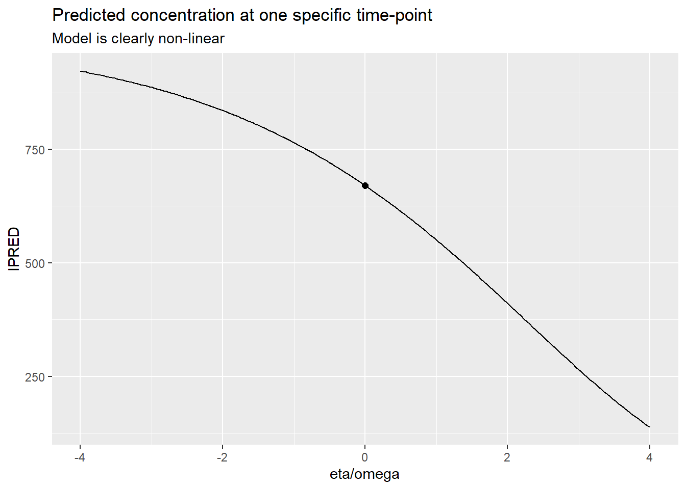
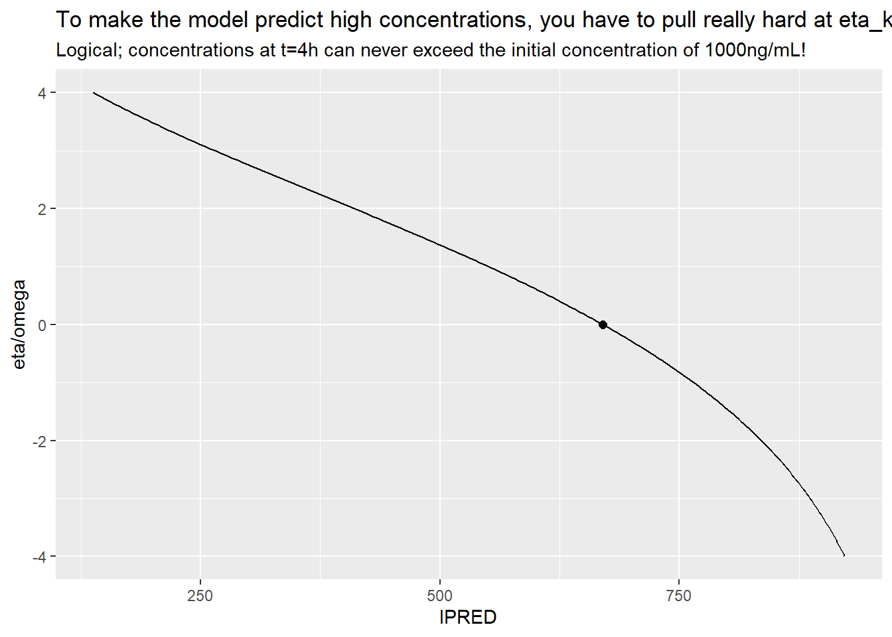
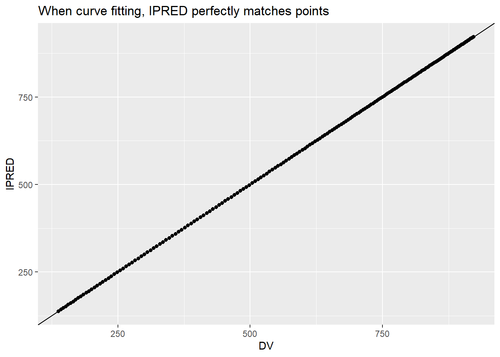
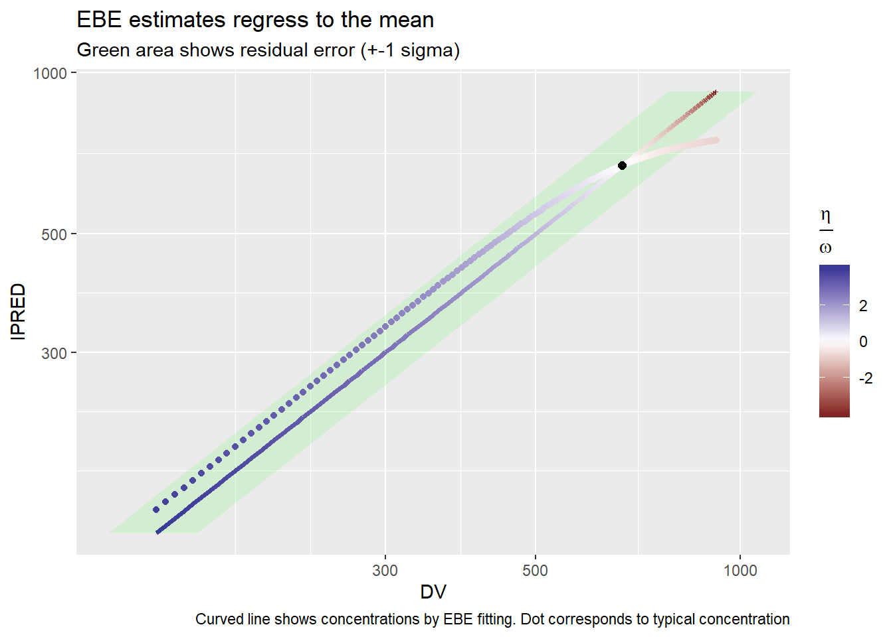
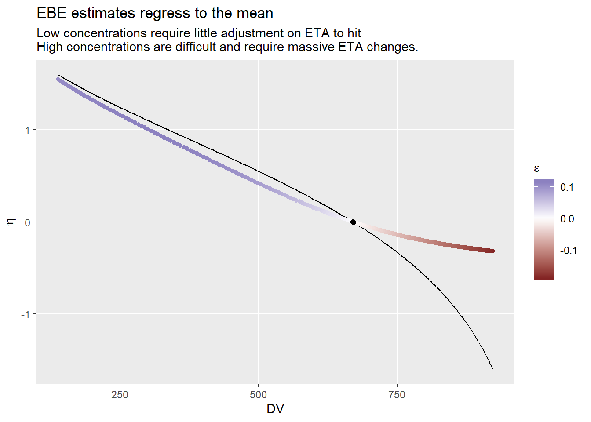
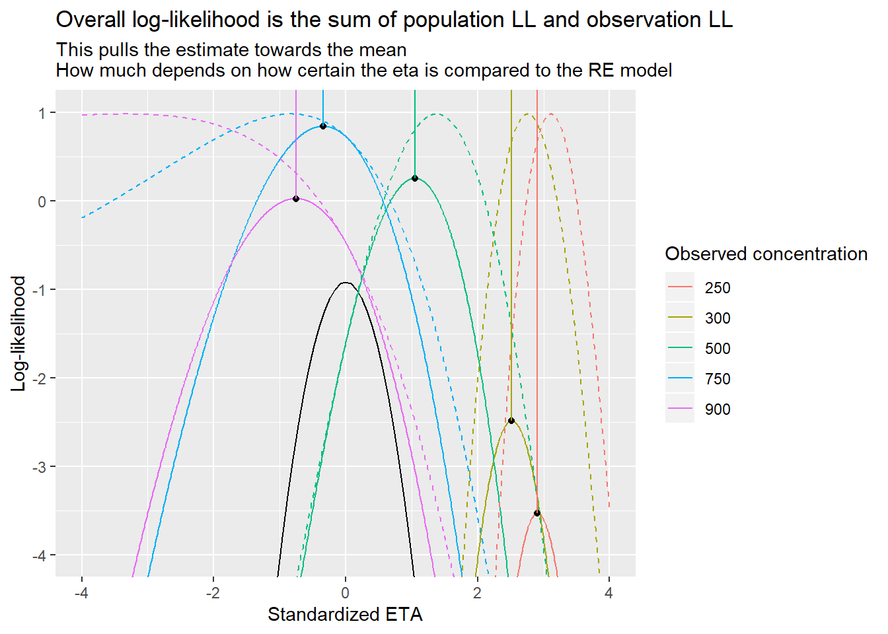
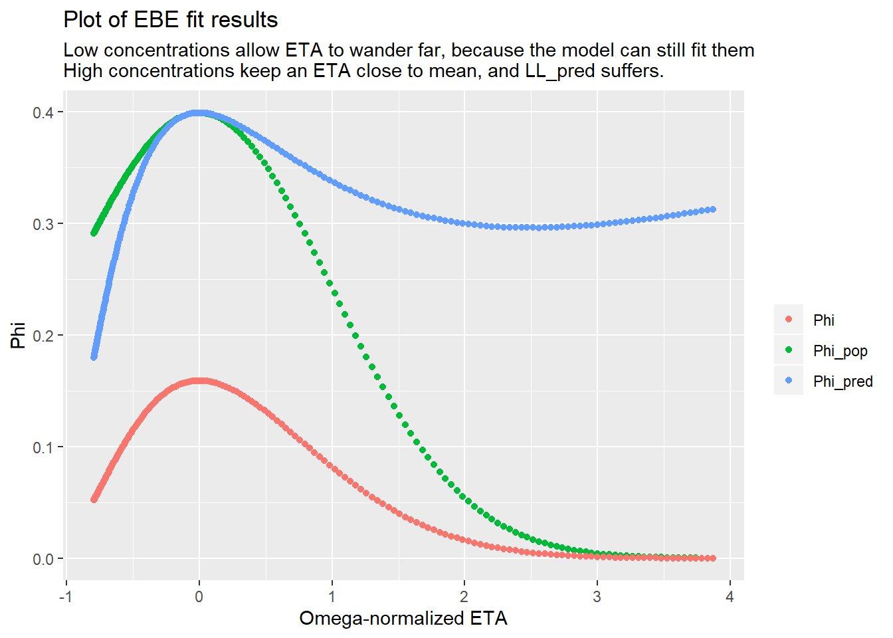

```r
library(tidyverse)
```

```
## -- Attaching packages ------------------------------------------------------------------------- tidyverse 1.2.1 --
```

```
## <U+221A> ggplot2 3.2.1     <U+221A> purrr   0.3.2
## <U+221A> tibble  2.1.3     <U+221A> dplyr   0.8.3
## <U+221A> tidyr   0.8.3     <U+221A> stringr 1.4.0
## <U+221A> readr   1.3.1     <U+221A> forcats 0.4.0
```

```
## -- Conflicts ---------------------------------------------------------------------------- tidyverse_conflicts() --
## x dplyr::filter() masks stats::filter()
## x dplyr::lag()    masks stats::lag()
```
# Science

This chapter reviews the main scientific basis behind TDMore

## Emperical Bayesian Estimation
TODO

## Predictive performance

## Predictive performance vs dose adaptation
### Definitions
Let us use a concrete example to evaluate whether predictive performance matches dose adaptation performance.

Our model is defined as follows

$$
C = \frac{D}{V} e^{-k(t-t_D)}
$$

For multiple doses:

$$
C = \sum\frac{D_i}{V} e^{-k(t-t_{D_i})}
$$

We define a very simple IIV model: $V = \theta_V$ and $k = \theta_k (1+\eta_k)$. We will call this single $\eta_k$ simply $\eta$.
Our residual error model is absolute: $C = Y + \epsilon$

### Simple curve fitting
We could simply fit the curve. Assuming we have a single dose, and a single measured concentration:

$$
\begin{aligned}
C_0 &= \frac{D}{V} e^{-k(t_0-t_D)} \\
  &= \frac{D}{V} e^{-\theta_k(1+\eta)(t_0-t_D)} \\
log(C_0) &= log(D/V) -\theta_k(1+\eta)(t_0-t_D) \\
\frac{log(C_0) - log(D/V)}{-\theta_k(t_0-t_D)} &= (1+\eta) \\
\frac{log(C_0) - log(D/V)}{-\theta_k(t_0-t_D)} - 1 &= \eta \\
\end{aligned}
$$

However, this does not take into account that there might be residual error in the measurement. We should use bayesian curve fitting instead.

### Empirical bayesian estimation
Let's define the likelihood for a given eta, assuming we have measured a concentration $C_0$ at time $t_0$:

$$
L = \Phi(\eta, 0, \omega) * \Phi(\epsilon, 0, \sigma) \\
with \\
C = Y + \epsilon \\
\epsilon = C-Y
$$

Let us fill in the likelihood for a normal distribution $\Phi(x|\mu,\sigma) = \frac{1}{\sqrt{2\pi\sigma^2}} e^{-\frac{(x-\mu)^2}{2\sigma^2}}$. We immediately use the Log-likelihood, and drop any terms that are not influenced by $\eta$.

$$
\begin{aligned}
LL &= \frac{\eta^2}{2\omega^2}+ \frac{\epsilon^2}{2\sigma^2} \\
 &= \frac{\eta^2}{2\omega^2}+ \frac{\epsilon^2}{2\sigma^2}
\end{aligned}
$$

We now find the optimum, which is at the point where the derivative is 0.

$$
\frac{dLL}{d\eta} = \frac{2\eta}{2\omega^2}+ \frac{2\epsilon}{2\sigma^2} \frac{d\epsilon}{d\eta}
$$

We calculate $\frac{d\epsilon^2}{d\eta}$:

$$
\begin{aligned}
\frac{d\epsilon}{d\eta} &= \frac{d}{d\eta} \left(   C-Y    \right) \\
 &= -\frac{dY}{d\eta} \\
 &= -\frac{d}{d\eta}\left( \frac{D}{V} e^{-\theta_k(1+\eta)(t-t_D)}  \right) \\
 &= -\frac{D}{V} e^{-\theta_k(1+\eta)(t-t_D)} \frac{d}{d\eta}\left(  -\theta_k(1+\eta)(t-t_D)  \right) \\
 &= \frac{D}{V} e^{-\theta_k(1+\eta)(t-t_D)} \theta_k (t-t_D)
$$


$$
\begin{aligned}
\frac{dLL}{d\eta} &= \frac{2\eta}{2\omega^2}+ \frac{2\epsilon}{2\sigma^2} \frac{d\epsilon}{d\eta} \\
 &= \frac{\eta}{\omega^2}+ \frac{2\epsilon}{2\sigma^2} Y\theta_k(t-tD) \\
 &= \frac{\eta}{\omega^2}+ \frac{1}{\sigma^2} (C-Y)Y\theta_k(t-tD) \\
 &= 0 \  at\  maximum
\end{aligned}
$$

Even using the simplest possible model, the above equation does not have an analytical solution. 

Instead, we can explore how parameter estimates (and model predictions) change in function of different parameter values. We use a proportional error model and lognormal IIV, to be more realistic.


```r
TVk <- 0.1 #/h
V <- 10 #L
D <- 10 #mg
omega=0.40 #lognormal
sigma=0.15 #proportional
t=4 #4h post-dose
predFun <- function(eta) tdmore::pk1cptiv_(t=t, TIME=0, AMT=D, V=V, K=TVk*exp(eta)) * 1000

etaRange <- seq(-4, 4, length.out=200)*omega
ggplot(tibble(x=etaRange/omega, y=sapply(etaRange, predFun)) ) +
  geom_line(aes(x=x, y=y)) +
  annotate("point", size=2, x=0, y=predFun(0)) +
  labs(x="eta/omega", y="IPRED", title="Predicted concentration at one specific time-point", subtitle="Model is clearly non-linear")
```



```r
ggplot(tibble(x=etaRange/omega, y=sapply(etaRange, predFun)) ) +
  geom_line(aes(x=y, y=x)) +
  annotate("point", size=2, x=predFun(0), y=0) +
  labs(y="eta/omega", x="IPRED", title="To make the model predict high concentrations, you have to pull really hard at eta_k",
       subtitle="Logical; concentrations at t=4h can never exceed the initial concentration of 1000ng/mL!")
```




```r
## CurveFit comes up with the theoretical eta, disregarding omega/sigma entirely
curveFit <- function(C) {
  fun <- function(eta, C) {
    Y <- predFun(eta)
    epsilon <-  Y/C -1
    epsilon^2
  }
  res <- stats::optimize(fun, interval=c(-10*omega, 10*omega), C=C)
  res$minimum
}

testRange <- seq(-4, 4, length.out=200)*omega
sim <- tibble::tibble( trueEta = testRange ) %>%
  rowwise() %>%
  mutate(
    C=predFun(trueEta),
    CurveFitEta = curveFit(C),
    CurveFitIPRED = predFun(CurveFitEta)
  )
ggplot(sim, aes(x=C, y=CurveFitIPRED)) + geom_point() + geom_abline() +
  labs(x="DV", y="IPRED", title="When curve fitting, IPRED perfectly matches points")
```




```r
ll <- function(eta, C, pop=F, pred=F) {
    Y <- predFun(eta)
    epsilon <- Y/C -1
    LLpop <- dnorm(eta, 0, omega, log=TRUE)
    LLpred <- dnorm(epsilon, 0, sigma, log=TRUE)
    if(pop) return(LLpop)
    if(pred) return(LLpred)
    return(-2*(LLpop + LLpred))
}
etaFun <- function(C) {
  res <- stats::optimize(ll, interval=c(-10, 10)*omega, C=C)
  res$minimum
}

sim <- sim %>% mutate(
  ebeEta = etaFun(C),
  ebeIPRED = predFun(ebeEta)
)

ggplot(sim, aes(y=C)) + 
  geom_ribbon(aes(x=CurveFitIPRED, ymin=C-sigma*C, ymax=C+sigma*C), fill='green', alpha=0.1) +
  geom_line(aes(x=CurveFitIPRED, color=CurveFitEta/omega), lwd=1.3) +
  geom_point(aes(x=ebeIPRED, color=ebeEta/omega)) +
  scale_x_log10() +
  scale_y_log10() +
  scale_color_gradient2() +
  annotate("point", size=2, x=predFun(0), y=predFun(0)) +
  coord_flip() +
  labs(y="DV", x="IPRED", title="EBE estimates regress to the mean",
       subtitle="Green area shows residual error (+-1 sigma)",
       color=expression(frac(eta, omega)),
       caption="Curved line shows concentrations by EBE fitting. Dot corresponds to typical concentration")
```



```r
ggplot(sim, aes(x=C)) + 
  geom_hline(yintercept=0, linetype=2) +
  geom_line(aes(y=CurveFitEta)) +
  geom_point(aes(y=ebeEta, color=ebeIPRED/C -1)) +
  annotate("point", size=2, x=predFun(0), y=0) +
  scale_color_gradient2() +
#  scale_x_log10() +
  labs(x="DV",
       y=expression(eta),
       color=expression(epsilon),
       title="EBE estimates regress to the mean",
       subtitle="Low concentrations require little adjustment on ETA to hit
High concentrations are difficult and require massive ETA changes."
  )
```



Let's analyse the behaviour for low concentrations and high concentrations


```r
llProfile <- function(C, interval=c(-4, 4)*omega) {
  etaRange <- seq(interval[1], interval[2], length.out=1000)
  tibble::tibble(eta=etaRange, 
                 OFV=sapply(etaRange, ll, C), 
                 LLpop=sapply(etaRange, ll, C, pop=T), 
                 LLpred=sapply(etaRange, ll, C, pred=T),
                 etaHat=etaFun(C),
                 OFVHat=ll(etaHat, C))
}

CONCTest=c(250, 300, 500, 750, 900)
tibble(C=CONCTest) %>% group_by(C) %>% group_modify(~llProfile(.y$C)) %>%
  ggplot(aes(x=eta/omega)) +
  stat_function(fun=~dnorm(.x/omega, log=T)) +
  geom_line(aes(y=LLpop+LLpred, group=C, color=factor(C))) +
  geom_line(aes(y=LLpred, group=C, color=factor(C)), linetype=2) +
  geom_point(aes(x=etaHat/omega, y=OFVHat/-2)) +
  geom_segment(aes(x=etaHat/omega, y=OFVHat/-2, xend=stat(x), yend=Inf, color=factor(C))) +
  coord_cartesian(ylim=c(-4, 1)) +
  labs(x="Standardized ETA", y="Log-likelihood", color="Observed concentration",
       title="Overall log-likelihood is the sum of population LL and observation LL",
       subtitle="This pulls the estimate towards the mean\nHow much depends on how certain the eta is compared to the RE model")
```



```r
ggplot(sim) + 
  geom_point(aes(x=dnorm(ebeEta/omega, log=T), 
                 y=dnorm((ebeIPRED/C -1)/sigma, log=T),
                 color=C
                 )) +
  annotate("point", x=dnorm(0, log=T), y=dnorm(0, log=T)) +
  scale_color_gradient2(midpoint=predFun(0)) +
  labs(x="LL_pop", y="LL_pred", title="Do we pick an eta that nicely splits LL between LL_pop and LL_pred?",
       subtitle="For high concentrations, LL_pop is maintained and we accept a reduced LL_pred.
For low concentrations, LL_pred is maintained and we accept a reduced LL_pop.
Direct result of non-linear model."
       ) +
  coord_fixed()
```


```r
ggplot(sim, aes(x=ebeEta/omega)) + 
  geom_point(aes(y=dnorm(ebeEta/omega), color="Phi_pop")) +
  geom_point(aes(y=dnorm((ebeIPRED/C -1)/sigma), color="Phi_pred")) +
  geom_point(aes(y=dnorm(ebeEta/omega)*dnorm((ebeIPRED/C -1)/sigma), color="Phi")) +
  labs(x="Omega-normalized ETA", y="Phi", color="",
       title="Plot of EBE fit results",
       subtitle=
"Low concentrations allow ETA to wander far, because the model can still fit them
High concentrations keep an ETA close to mean, and LL_pred suffers.")
```


