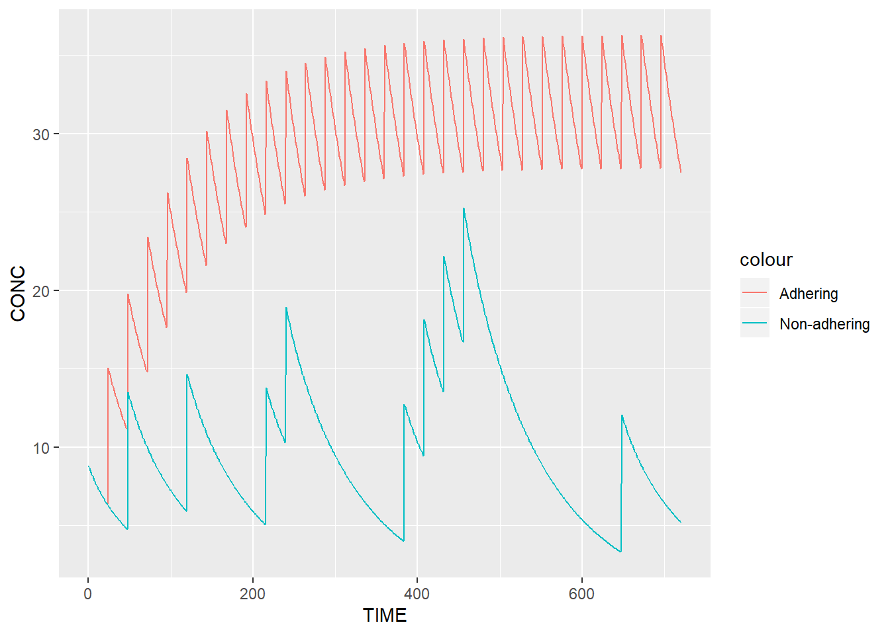
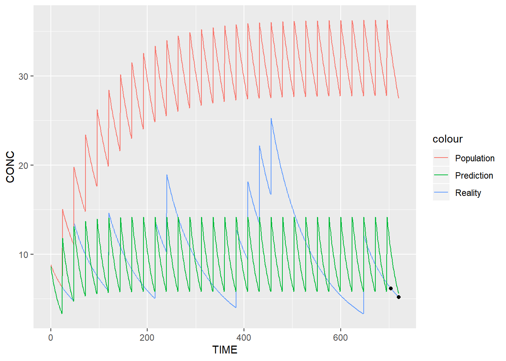

# Vignettes  {#vignettes}

## Running TDMore

### Creating your model {-}

There are several ways telling TDMore what your model is. The easiest way is to provide the model in the form of a nxlmir model. The following example shows how a 2-compartment-PK model can be written. For the purpose of this demonstration, the 'Meropenem' PK model will be used. As Meropenem is given by injection into a vein, the absorption compartment is omitted.


```r
library(nlmixr)

modelCode <- function(){
  ini({
    TVV1 <- 24.4;
    TVV2 <- 7.01;
    TVQ <- 4.97;
    TVCL <- 9.87;
    ECL ~ 0.194 # This value corresponds to OMEGA_CL (44% SD)
    EV1 ~ 0.287 # This value corresponds to OMEGA_V1 (54% SD)
    EPS_PROP <- 0.371 # Proportional error (37% SD)
  })
  model({
    CL <- TVCL * exp(ECL)
    V1 <- TVV1 * exp(EV1)
    V2 <- TVV2
    Q <- TVQ
    K12 <- Q/V1
    K21 <- Q/V2

    d/dt(center) = - CL/V1 * center - K12*center + K21 * periph
    d/dt(periph) = K12*center - K21 * periph

    CONC = center / V1
    CONC ~ prop(EPS_PROP) # Proportional error linked to the PK model
  })
}
```

Once the model is created, a TDMore object can be instantiated as follows:


```r
library(tdmore)

nlmixrUI <- nlmixrUI(modelCode)
tdmore <- tdmore(nlmixrUI)
```

The TDMore object is now ready for use.

### Predicting new data {-}

TDMore can be used to run simulations, based on the model defined in the previous step. For doing so, the regimen first needs to be specified. In the case of Meropenem, an 30-min injection is given into the central compartment every 8 hour. This can be written as follows:


```r
regimen <- data.frame(
  TIME=c(0, 8, 16),            # Every 8 hour and for 1 day, an injection is given
  AMT=c(1000, 1000, 1000),     # 1g is administered
  RATE=c(1000, 1000, 1000)/0.5 # 30-minute infusion (rate=dose/infusion time)
)
```

Let's now simulate the population PK model for 1 day. This can be done using the TDMore predict() function. A dataframe with all the times to predict (and respective NA concentration) is given to the 'newdata' argument. Field 'se' is set to true, it tells TDMore we are interested to simulate the model with residual variability.


```r
data <- predict(
  object = tdmore,
  newdata = data.frame(TIME = seq(0, 24, by = 0.5), CONC = NA),
  regimen = regimen,
  se = TRUE
  )
  
library(ggplot2)
ggplot(data, aes(x=TIME, y=CONC)) +
  geom_ribbon(aes(fill="Population", ymin=CONC.lower, ymax=CONC.upper), fill="steelblue2", alpha=0.15) +
  geom_line(aes(color="Population"), data=data) +
  scale_color_manual(values=c("steelblue2")) +
  scale_y_log10()
```


The plot above shows the median of the population (typical profile) and its 95% confidence interval. The range of the confidence interval can be changed using the argument 'level'.

### Estimating individual parameters {-}

This section will show you how the individual parameters can be estimated, based on some observed data. Let's first estimate the parameters of a typical individual. This is achieved by calling the estimate() function.


```r
pred <- estimate(tdmore, regimen = regimen)
coef(pred)
```

```
## ECL EV1 
##   0   0
```

Both eta's ECL and EV1 have been estimated to 0. This is not surprising, as zero eta's best describe the population average. We can also look at the uncertainty on these estimates.


```r
vcov(pred)
```

```
##              ECL          EV1
## ECL 1.940000e-01 1.090438e-13
## EV1 1.090438e-13 2.870000e-01
```

This uncertainty is equal to the population inter-individual variability (OMEGA matrix). Now, let's assume blood samples have been collected for a subject X at different times. For example, blood samples were collected at times 9h and 16h on the first day. This can be translated in TDMore as follows (note that the concentrations are purely fictive):


```r
observed <- data.frame(TIME=c(9, 15), CONC=c(30, 2))
```

We can ask TDMore to re-estimate the parameters for this specific individual:


```r
ipred <- estimate(tdmore, observed = observed, regimen = regimen)
coef(ipred)
```

```
##        ECL        EV1 
##  0.2597598 -0.1320256
```

Eta's obtained by calling 'coef' on pred maximise altogether the likelihood for this specific subject. The variance-covariance matrix shows the uncertainty of the individual estimates, and their correlation.


```r
vcov(ipred)
```

```
##            ECL        EV1
## ECL 0.03154125 0.04680262
## EV1 0.04680262 0.12759879
```

Predictions for the population (pred) and this specific subject (ipred) can be compared using the following snippet: 


```r
data <- predict(ipred, newdata=data.frame(TIME=seq(0, 24, 0.1), CONC=NA), se=TRUE)
ggplot(data, aes(x=TIME))  +
  geom_line(aes(color="Individual", y=CONC.median)) +
  geom_ribbon(aes(fill="Individual", ymin=CONC.lower, ymax=CONC.upper), fill="tomato1", alpha=0.10) +
  geom_line(aes(color="Population", y=CONC), data=predict(pred, newdata=seq(0, 24, 0.1))) +
  geom_point(aes(y=CONC), data=observed) +
  scale_color_manual(values=c("tomato1", "steelblue2")) +
  scale_y_log10()
```


Ipred and pred are shown respectively in red and blue. A 95% confidence interval has been added around the ipred prediction. Note that the default TDMore plotting function can also be used to obtain the exact same plot in a single line of code:


```r
plot(ipred, newdata=data.frame(TIME=seq(0.1, 24, by=0.1), CONC=NA)) + scale_y_log10()
```

### Finding the right dose to give {-}

A very interesting feature in TDMore is the possibility to ask the framework the next dose to be given knowing all the previous observations that were collected and some known end-points. For example, assume we still collected the same two observations on the first day, we would like to find the best first dose to be given on the second day. We would like to reach the trough concentration of 3.10 mg/L as much as possible. This can be expressed, as follows:


```r
newRegimen <- data.frame(
  TIME=c(0, 8, 16, 24),              # A fourth dose on the second day is added
  AMT=c(1000, 1000, 1000, NA),       # Adding an unknown dose on the second day
  RATE=c(1000, 1000, 1000, 1000)/0.5 # 30-minute infusion (rate=dose/infusion time)
)

recommendation <- findDose(
  ipred,
  regimen = newRegimen,
  interval = c(100, 5000),
  target = data.frame(TIME = 32, CONC = 8)
  )
summary(recommendation)
```

```
## $dose
## [1] 4540.072
## 
## $regimen
##   TIME      AMT RATE
## 1    0 1000.000 2000
## 2    8 1000.000 2000
## 3   16 1000.000 2000
## 4   24 4540.072 2000
```

The result of the findDose() routine is shown above. It tells us that XXX mg (approximately) is the recommended starting dose on the second day. The following code helps up verify this visually.


```r
# Recommended regimen for individual can be directly accessed from the recommendation object
ipredRecommendedRegimen <- recommendation$regimen

# Population regimen can be updated using the 'updateRegimen' method, a 4th dose of 1000 is used
predUpdatedRegimen <- updateRegimen(regimen = newRegimen, newDose = 4500)
print(predUpdatedRegimen) # Check pred regimen
```

```
##   TIME  AMT RATE
## 1    0 1000 2000
## 2    8 1000 2000
## 3   16 1000 2000
## 4   24 4500 2000
```


```r
ipred <- estimate(tdmore, observed = observed, regimen = ipredRecommendedRegimen)
pred <- estimate(tdmore, regimen = predUpdatedRegimen)
```


```r
plot(ipred, newdata=seq(0, 32, by=0.1)) + geom_hline(yintercept=8) + scale_y_log10()
```


The plot above demonstrates that the individual is reaching the trough concentration quite well after the first administration on the second day. 

### Code appendix

```r
set.seed(0) 
library(nlmixr)

modelCode <- function(){
  ini({
    TVV1 <- 24.4;
    TVV2 <- 7.01;
    TVQ <- 4.97;
    TVCL <- 9.87;
    ECL ~ 0.194 # This value corresponds to OMEGA_CL (44% SD)
    EV1 ~ 0.287 # This value corresponds to OMEGA_V1 (54% SD)
    EPS_PROP <- 0.371 # Proportional error (37% SD)
  })
  model({
    CL <- TVCL * exp(ECL)
    V1 <- TVV1 * exp(EV1)
    V2 <- TVV2
    Q <- TVQ
    K12 <- Q/V1
    K21 <- Q/V2

    d/dt(center) = - CL/V1 * center - K12*center + K21 * periph
    d/dt(periph) = K12*center - K21 * periph

    CONC = center / V1
    CONC ~ prop(EPS_PROP) # Proportional error linked to the PK model
  })
}

library(tdmore)

nlmixrUI <- nlmixrUI(modelCode)
tdmore <- tdmore(nlmixrUI)
regimen <- data.frame(
  TIME=c(0, 8, 16),            # Every 8 hour and for 1 day, an injection is given
  AMT=c(1000, 1000, 1000),     # 1g is administered
  RATE=c(1000, 1000, 1000)/0.5 # 30-minute infusion (rate=dose/infusion time)
)
data <- predict(
  object = tdmore,
  newdata = data.frame(TIME = seq(0, 24, by = 0.5), CONC = NA),
  regimen = regimen,
  se = TRUE
  )
  
library(ggplot2)
ggplot(data, aes(x=TIME, y=CONC)) +
  geom_ribbon(aes(fill="Population", ymin=CONC.lower, ymax=CONC.upper), fill="steelblue2", alpha=0.15) +
  geom_line(aes(color="Population"), data=data) +
  scale_color_manual(values=c("steelblue2")) +
  scale_y_log10()
  
pred <- estimate(tdmore, regimen = regimen)
coef(pred)
vcov(pred)
observed <- data.frame(TIME=c(9, 15), CONC=c(30, 2))
ipred <- estimate(tdmore, observed = observed, regimen = regimen)
coef(ipred)
vcov(ipred)
data <- predict(ipred, newdata=data.frame(TIME=seq(0, 24, 0.1), CONC=NA), se=TRUE)
ggplot(data, aes(x=TIME))  +
  geom_line(aes(color="Individual", y=CONC.median)) +
  geom_ribbon(aes(fill="Individual", ymin=CONC.lower, ymax=CONC.upper), fill="tomato1", alpha=0.10) +
  geom_line(aes(color="Population", y=CONC), data=predict(pred, newdata=seq(0, 24, 0.1))) +
  geom_point(aes(y=CONC), data=observed) +
  scale_color_manual(values=c("tomato1", "steelblue2")) +
  scale_y_log10()
plot(ipred, newdata=data.frame(TIME=seq(0.1, 24, by=0.1), CONC=NA)) + scale_y_log10()
newRegimen <- data.frame(
  TIME=c(0, 8, 16, 24),              # A fourth dose on the second day is added
  AMT=c(1000, 1000, 1000, NA),       # Adding an unknown dose on the second day
  RATE=c(1000, 1000, 1000, 1000)/0.5 # 30-minute infusion (rate=dose/infusion time)
)

recommendation <- findDose(
  ipred,
  regimen = newRegimen,
  interval = c(100, 5000),
  target = data.frame(TIME = 32, CONC = 8)
  )
summary(recommendation)
# Recommended regimen for individual can be directly accessed from the recommendation object
ipredRecommendedRegimen <- recommendation$regimen

# Population regimen can be updated using the 'updateRegimen' method, a 4th dose of 1000 is used
predUpdatedRegimen <- updateRegimen(regimen = newRegimen, newDose = 4500)
print(predUpdatedRegimen) # Check pred regimen
ipred <- estimate(tdmore, observed = observed, regimen = ipredRecommendedRegimen)
pred <- estimate(tdmore, regimen = predUpdatedRegimen)
plot(ipred, newdata=seq(0, 32, by=0.1)) + geom_hline(yintercept=8) + scale_y_log10()
```

## Multiple endpoints

### Writing and testing the PK model {-}

In this vignette, we will learn how TDMore can deal with multiple endpoints. The PK/PD models chosen to illustrate this section are based on the following paper: "Population PK/PD modeling of Sunitinib by dosing schedule in patients with advanced renal cell carcinoma or gastrointestinal stromal tumor.". 

Let's start writing the Sunitinib PK model.  
  


```r
library(nlmixr)

modelCode <- function(){
  ini({
    TVCL <- 34.1
    TVVc <- 2700
    TVKa <- 0.126
    TVVp <- 774
    TVQ <- 0.688

    ECL ~ 0.060516 # 24.6%
    EVc ~ 0.052900 # 23.0%
    EKa ~ 2.755600 # 166%

    EPS_Prop <- 0.417
  })
  model({
    CL <- TVCL * exp(ECL)
    Vc <- TVVc * exp(EVc)
    Vp <- TVVp
    Q <- TVQ
    K12 <- Q/Vc
    K21 <- Q/Vp
    Ke <- CL/Vc
    Ka <- TVKa*exp(EKa)

    d/dt(depot) = -Ka*depot
    d/dt(center) = Ka*depot - Ke*center - K12*center + K21*periph
    d/dt(periph) = K12*center - K21*periph

    CONC = center/Vc
    CONC ~ prop(EPS_Prop)
  })
}
```

The TDMore object is instantiated as follows:


```r
library(tdmore)

nlmixrModel <- nlmixrUI(modelCode)
```

```
## Warning in get(.i, envir = .env): restarting interrupted promise evaluation
```

```
## Warning in gzfile(file, "rb"): cannot open compressed file '.
## \render14cc26b95aee.rds', probable reason 'No such file or directory'
```

```r
m1 <- tdmore(nlmixrModel)
```

A basic regimen can be created to test that the model is running properly. The standard regimen of Sunitinib is 50mg daily for 4 weeks.


```r
regimen <- data.frame(
  TIME=0,     # First dose time: t=0h
  AMT=50,     # Dose amount: 50 mg
  II=24,      # Dose interval: 24h
  ADDL=4*7-1  # Additional doses: 4 weeks
)

times <- seq(0, 6*7*24) # Observation times
```

This regimen can be plotted using the default TDMore plotting function. It shows the typical value of the population and the between-subject variability (95% confidence interval).


```r
plot(m1, regimen, newdata=times)
```


### Adding a PD model {-}

Suppose we received a full blood workup: Sunitinib concentration, Alanine aminotransferase (ALT), Aspartate aminotransferase (AST), Absolute neutrophil count (ANC), Platelet count (PC) and Lymphocyte count (LC). We also measured the subject's diastolic blood pressure (DBP).

We can create a single model to predict all of these aspects. In the example below, we will focus on ALT and AST. Please note the mandatory '|' nlmixr syntax used to describe the residual variability of different endpoints.


```r
modelCode <- function(){
  ini({
    # PK model sunitinib
    TVCL <- 34.1
    TVVc <- 2700
    TVKa <- 0.126
    TVVp <- 774
    TVQ <- 0.688

    ECL ~ 0.060516 # 24.6%
    EVc ~ 0.052900 # 23.0%
    EKa ~ 2.755600 # 166%

    EPS_Prop <- 0.417 # Proportional error 1 (related to CONC)

    # PD model ALT
    TVBASE_AST <- 21.5
    TVKout_AST <- 0.0142
    TVKpd_AST <- 0.00572
    
    EPS_Prop_AST = 0.257 #25.7%

    # PD model AST
    TVBASE_ALT <- 21.2
    TVKout_ALT <- 0.00916
    TVKpd_ALT <- 0.00401
    
    EPS_Prop_ALT = 0.373 #37.3%

    # We assume 0.5 correlations in IIV, even though they are not reported in the original paper    
    EBASE_AST + EBASE_ALT ~ c(0.101124,
                              0.05028021, 0.164025)  # 31.8% #40.5%
    EKout_AST + EKout_ALT ~ c(1.440000,
                  0.1897367, 1.638400)#120%  #128%
    EKpd_AST + EKpd_ALT ~ c(0.114244,
                  0.05344249, 0.324900) #33.8% #57.0%
  })
  model({
    # PK parameters
    CL <- TVCL * exp(ECL)
    Vc <- TVVc * exp(EVc)
    Vp <- TVVp
    Q <- TVQ
    K12 <- Q/Vc
    K21 <- Q/Vp
    Ke <- CL/Vc
    Ka <- TVKa*exp(EKa)

    # AST parameters    
    BASE_AST <- TVBASE_AST * exp(EBASE_AST)
    Kout_AST <- TVKout_AST * exp(EKout_AST)
    Kpd_AST <- TVKpd_AST * exp(EKpd_AST) #mL/ng
    Kin_AST <- Kout_AST * BASE_AST
    
    # ALT parameters
    BASE_ALT <- TVBASE_ALT * exp(EBASE_ALT)
    Kout_ALT <- TVKout_ALT * exp(EKout_ALT)
    Kpd_ALT <- TVKpd_ALT * exp(EKpd_ALT) #mL/ng
    Kin_ALT <- Kout_ALT * BASE_ALT

    # PK model
    d/dt(depot) = -Ka*depot
    d/dt(center) = Ka*depot - Ke*center - K12*center + K21*periph
    d/dt(periph) = K12*center - K21*periph
    CONC = center/Vc * 1000 #ng/mL
        
    # AST model
    AST(0) = BASE_AST
    d/dt(AST) = Kin_AST - Kout_AST*AST*(1-Kpd_AST*CONC)
    
    # ALT model
    ALT(0) = BASE_ALT
    d/dt(ALT) = Kin_ALT - Kout_ALT*ALT*(1-Kpd_ALT*CONC)
    
    # Residual error models
    CONC ~ prop(EPS_Prop) | center # Define error model 1
    AST ~ prop(EPS_Prop_AST) | AST # error model 2
    ALT ~ prop(EPS_Prop_ALT) | ALT # error model 3
  })
}
nlmixrModel <- nlmixrUI(modelCode)
```

```
## Warning in get(.i, envir = .env): restarting interrupted promise evaluation
```

```
## Warning in gzfile(file, "rb"): cannot open compressed file '.
## \render14cc26b95aee.rds', probable reason 'No such file or directory'
```

```r
m2 <- tdmore(nlmixrModel, maxsteps=1E3*500)
```

Let's now have a look at the evolution of these safety signals over time. To have a good overview, we will observe ALT/AST for 4 weeks treatment. The default plot shows once again the typical value and the between-subject variability (95% CI).


```r
regimen <- data.frame(
  TIME=0,
  AMT=50,
  II=24,
  ADDL=4*7
)
times <- seq(0, 6*7*24, by=1)

plot(m2, regimen, newdata=data.frame(TIME=times, CONC=NA))
```


```r
plot(m2, regimen, newdata=data.frame(TIME=times, ALT=NA))
```


```r
plot(m2, regimen, newdata=data.frame(TIME=times, AST=NA))
```


### Estimating individual parameters {-}
We get the values for ALT/AST for a specific individual. These are quite high!


```r
observed <- data.frame(
  TIME=c(0, 2,3,4)*7*24, 
  CONC=NA,
  ALT=c(21, 40, 42, 43),
  AST=c(21, 45, 47, 49))
ipred <- estimate(m2, observed = observed, regimen = regimen)

plot(ipred, newdata=data.frame(TIME=times, CONC=NA))
```


```r
plot(ipred, newdata=data.frame(TIME=times, ALT=NA))
```


```r
plot(ipred, newdata=data.frame(TIME=times, AST=NA))
```


Based on only ALT/AST values, we managed to define the PK inter-individual variability a little better. Indeed, these high ALT/AST values can be best explained through a combination of high sensitivity (EKpd), and a lower clearance (ECL) of the drug.

```r
coef(ipred)
```

```
##         ECL         EVc         EKa   EBASE_AST   EBASE_ALT   EKout_AST 
## -0.13927141 -0.01279161  0.02257760  0.03233717  0.04497158  0.22456560 
##   EKout_ALT    EKpd_AST    EKpd_ALT 
##  0.22778905  0.24279322  0.37291944
```

```r
coef(ipred) / sqrt(diag(m2$omega))
```

```
##         ECL         EVc         EKa   EBASE_AST   EBASE_ALT   EKout_AST 
## -0.56614395 -0.05561569  0.01360096  0.10168920  0.11104095  0.18713800 
##   EKout_ALT    EKpd_AST    EKpd_ALT 
##  0.17796020  0.71832312  0.65424462
```

### Code appendix

```r
set.seed(0) 
library(nlmixr)

modelCode <- function(){
  ini({
    TVV1 <- 24.4;
    TVV2 <- 7.01;
    TVQ <- 4.97;
    TVCL <- 9.87;
    ECL ~ 0.194 # This value corresponds to OMEGA_CL (44% SD)
    EV1 ~ 0.287 # This value corresponds to OMEGA_V1 (54% SD)
    EPS_PROP <- 0.371 # Proportional error (37% SD)
  })
  model({
    CL <- TVCL * exp(ECL)
    V1 <- TVV1 * exp(EV1)
    V2 <- TVV2
    Q <- TVQ
    K12 <- Q/V1
    K21 <- Q/V2

    d/dt(center) = - CL/V1 * center - K12*center + K21 * periph
    d/dt(periph) = K12*center - K21 * periph

    CONC = center / V1
    CONC ~ prop(EPS_PROP) # Proportional error linked to the PK model
  })
}

library(tdmore)

nlmixrUI <- nlmixrUI(modelCode)
tdmore <- tdmore(nlmixrUI)
regimen <- data.frame(
  TIME=c(0, 8, 16),            # Every 8 hour and for 1 day, an injection is given
  AMT=c(1000, 1000, 1000),     # 1g is administered
  RATE=c(1000, 1000, 1000)/0.5 # 30-minute infusion (rate=dose/infusion time)
)
data <- predict(
  object = tdmore,
  newdata = data.frame(TIME = seq(0, 24, by = 0.5), CONC = NA),
  regimen = regimen,
  se = TRUE
  )
  
library(ggplot2)
ggplot(data, aes(x=TIME, y=CONC)) +
  geom_ribbon(aes(fill="Population", ymin=CONC.lower, ymax=CONC.upper), fill="steelblue2", alpha=0.15) +
  geom_line(aes(color="Population"), data=data) +
  scale_color_manual(values=c("steelblue2")) +
  scale_y_log10()
  
pred <- estimate(tdmore, regimen = regimen)
coef(pred)
vcov(pred)
observed <- data.frame(TIME=c(9, 15), CONC=c(30, 2))
ipred <- estimate(tdmore, observed = observed, regimen = regimen)
coef(ipred)
vcov(ipred)
data <- predict(ipred, newdata=data.frame(TIME=seq(0, 24, 0.1), CONC=NA), se=TRUE)
ggplot(data, aes(x=TIME))  +
  geom_line(aes(color="Individual", y=CONC.median)) +
  geom_ribbon(aes(fill="Individual", ymin=CONC.lower, ymax=CONC.upper), fill="tomato1", alpha=0.10) +
  geom_line(aes(color="Population", y=CONC), data=predict(pred, newdata=seq(0, 24, 0.1))) +
  geom_point(aes(y=CONC), data=observed) +
  scale_color_manual(values=c("tomato1", "steelblue2")) +
  scale_y_log10()
plot(ipred, newdata=data.frame(TIME=seq(0.1, 24, by=0.1), CONC=NA)) + scale_y_log10()
newRegimen <- data.frame(
  TIME=c(0, 8, 16, 24),              # A fourth dose on the second day is added
  AMT=c(1000, 1000, 1000, NA),       # Adding an unknown dose on the second day
  RATE=c(1000, 1000, 1000, 1000)/0.5 # 30-minute infusion (rate=dose/infusion time)
)

recommendation <- findDose(
  ipred,
  regimen = newRegimen,
  interval = c(100, 5000),
  target = data.frame(TIME = 32, CONC = 8)
  )
summary(recommendation)
# Recommended regimen for individual can be directly accessed from the recommendation object
ipredRecommendedRegimen <- recommendation$regimen

# Population regimen can be updated using the 'updateRegimen' method, a 4th dose of 1000 is used
predUpdatedRegimen <- updateRegimen(regimen = newRegimen, newDose = 4500)
print(predUpdatedRegimen) # Check pred regimen
ipred <- estimate(tdmore, observed = observed, regimen = ipredRecommendedRegimen)
pred <- estimate(tdmore, regimen = predUpdatedRegimen)
plot(ipred, newdata=seq(0, 32, by=0.1)) + geom_hline(yintercept=8) + scale_y_log10()
set.seed(0) 
library(nlmixr)

modelCode <- function(){
  ini({
    TVCL <- 34.1
    TVVc <- 2700
    TVKa <- 0.126
    TVVp <- 774
    TVQ <- 0.688

    ECL ~ 0.060516 # 24.6%
    EVc ~ 0.052900 # 23.0%
    EKa ~ 2.755600 # 166%

    EPS_Prop <- 0.417
  })
  model({
    CL <- TVCL * exp(ECL)
    Vc <- TVVc * exp(EVc)
    Vp <- TVVp
    Q <- TVQ
    K12 <- Q/Vc
    K21 <- Q/Vp
    Ke <- CL/Vc
    Ka <- TVKa*exp(EKa)

    d/dt(depot) = -Ka*depot
    d/dt(center) = Ka*depot - Ke*center - K12*center + K21*periph
    d/dt(periph) = K12*center - K21*periph

    CONC = center/Vc
    CONC ~ prop(EPS_Prop)
  })
}

library(tdmore)

nlmixrModel <- nlmixrUI(modelCode)
m1 <- tdmore(nlmixrModel)
regimen <- data.frame(
  TIME=0,     # First dose time: t=0h
  AMT=50,     # Dose amount: 50 mg
  II=24,      # Dose interval: 24h
  ADDL=4*7-1  # Additional doses: 4 weeks
)

times <- seq(0, 6*7*24) # Observation times
plot(m1, regimen, newdata=times)
modelCode <- function(){
  ini({
    # PK model sunitinib
    TVCL <- 34.1
    TVVc <- 2700
    TVKa <- 0.126
    TVVp <- 774
    TVQ <- 0.688

    ECL ~ 0.060516 # 24.6%
    EVc ~ 0.052900 # 23.0%
    EKa ~ 2.755600 # 166%

    EPS_Prop <- 0.417 # Proportional error 1 (related to CONC)

    # PD model ALT
    TVBASE_AST <- 21.5
    TVKout_AST <- 0.0142
    TVKpd_AST <- 0.00572
    
    EPS_Prop_AST = 0.257 #25.7%

    # PD model AST
    TVBASE_ALT <- 21.2
    TVKout_ALT <- 0.00916
    TVKpd_ALT <- 0.00401
    
    EPS_Prop_ALT = 0.373 #37.3%

    # We assume 0.5 correlations in IIV, even though they are not reported in the original paper    
    EBASE_AST + EBASE_ALT ~ c(0.101124,
                              0.05028021, 0.164025)  # 31.8% #40.5%
    EKout_AST + EKout_ALT ~ c(1.440000,
                  0.1897367, 1.638400)#120%  #128%
    EKpd_AST + EKpd_ALT ~ c(0.114244,
                  0.05344249, 0.324900) #33.8% #57.0%
  })
  model({
    # PK parameters
    CL <- TVCL * exp(ECL)
    Vc <- TVVc * exp(EVc)
    Vp <- TVVp
    Q <- TVQ
    K12 <- Q/Vc
    K21 <- Q/Vp
    Ke <- CL/Vc
    Ka <- TVKa*exp(EKa)

    # AST parameters    
    BASE_AST <- TVBASE_AST * exp(EBASE_AST)
    Kout_AST <- TVKout_AST * exp(EKout_AST)
    Kpd_AST <- TVKpd_AST * exp(EKpd_AST) #mL/ng
    Kin_AST <- Kout_AST * BASE_AST
    
    # ALT parameters
    BASE_ALT <- TVBASE_ALT * exp(EBASE_ALT)
    Kout_ALT <- TVKout_ALT * exp(EKout_ALT)
    Kpd_ALT <- TVKpd_ALT * exp(EKpd_ALT) #mL/ng
    Kin_ALT <- Kout_ALT * BASE_ALT

    # PK model
    d/dt(depot) = -Ka*depot
    d/dt(center) = Ka*depot - Ke*center - K12*center + K21*periph
    d/dt(periph) = K12*center - K21*periph
    CONC = center/Vc * 1000 #ng/mL
        
    # AST model
    AST(0) = BASE_AST
    d/dt(AST) = Kin_AST - Kout_AST*AST*(1-Kpd_AST*CONC)
    
    # ALT model
    ALT(0) = BASE_ALT
    d/dt(ALT) = Kin_ALT - Kout_ALT*ALT*(1-Kpd_ALT*CONC)
    
    # Residual error models
    CONC ~ prop(EPS_Prop) | center # Define error model 1
    AST ~ prop(EPS_Prop_AST) | AST # error model 2
    ALT ~ prop(EPS_Prop_ALT) | ALT # error model 3
  })
}
nlmixrModel <- nlmixrUI(modelCode)
m2 <- tdmore(nlmixrModel, maxsteps=1E3*500)
regimen <- data.frame(
  TIME=0,
  AMT=50,
  II=24,
  ADDL=4*7
)
times <- seq(0, 6*7*24, by=1)

plot(m2, regimen, newdata=data.frame(TIME=times, CONC=NA))
plot(m2, regimen, newdata=data.frame(TIME=times, ALT=NA))
plot(m2, regimen, newdata=data.frame(TIME=times, AST=NA))
observed <- data.frame(
  TIME=c(0, 2,3,4)*7*24, 
  CONC=NA,
  ALT=c(21, 40, 42, 43),
  AST=c(21, 45, 47, 49))
ipred <- estimate(m2, observed = observed, regimen = regimen)

plot(ipred, newdata=data.frame(TIME=times, CONC=NA))
plot(ipred, newdata=data.frame(TIME=times, ALT=NA))
plot(ipred, newdata=data.frame(TIME=times, AST=NA))
coef(ipred)
coef(ipred) / sqrt(diag(m2$omega))
```

## Example: Detecting non-adherence

### About this example {-}

Non-compliance is an important issue endangering the effectiveness of treatments. In COPD, it is estimated that there is a non-compliance of more than 98% for inhaled treatments.

In this example, we use TDMore to compare the systemic concentrations of inhaled fluticasone propionate with the population predictions. We show that TDMore can be used to detect severe non-adherence, and to propose corrective action.

### The model {-}

Model taken from literature: Soulele, K., et al. "Population pharmacokinetics of fluticasone propionate/salmeterol using two different dry powder inhalers." European Journal of Pharmaceutical Sciences 80 (2015): 33-42.


```r
library(nlmixr)

modelCode <- function(){
  ini({
    TVKa <- 3.87
    TVCL <- 659 #L/h
    TVV1 <- 56900 #L
    TVV2 <- 5550 #L
    TVQ <- 259 #L/h
    
    EKa ~ 0.04507129 #0.2123**2
    ECL ~ 0.1535856 #0.3919**2
    EV1 ~ 0.09223369 #0.3037**2
    EV2 ~ 0.208301 #0.4564**2
    EQ ~ 0.1015697# 0.3187**2
    
    EPS_ADD <- 1.91 #
    EPS_PROP <- 0.117
  })
  model({
    Ka <- TVKa * exp(EKa)
    CL <- TVCL * exp(ECL)
    V1 <- TVV1 * exp(EV1)
    V2 <- TVV2 * exp(EV2)
    Q <- TVQ * exp(EQ)
    K12 <- Q/V1
    K21 <- Q/V2

    d/dt(center) = - CL/V1 * center - K12*center + K21 * periph
    d/dt(periph) = K12*center - K21 * periph

    CONC = center / V1 * 1000
    CONC ~ prop(EPS_PROP) + add(EPS_ADD)
  })
}
nlmixrModel <- nlmixrUI(modelCode)

library(tdmore)
m1 <- tdmore(nlmixrModel)
```


We now define the treatment regimen


```r
regimen <- data.frame(
  TIME=seq(0, by=24, length.out=30),
  AMT=500 # 500ug standard dose
)

adhering <- predict(m1, regimen=regimen, newdata=seq(0, 30*24))

actual <- data.frame(
  TIME=seq(0, by=24, length.out=30),
  AMT=500*sample(c(0,1), 30, replace=TRUE) # probability of 50% to not take the dose
)
nonAdhering <- predict(m1, regimen=actual, newdata=seq(0, 30*24))

library(ggplot2)
pred <- estimate(m1, regimen=regimen)
ggplot(mapping=aes(x=TIME, y=CONC)) +
  geom_line(aes(color="Adhering"), data=adhering) +
  geom_line(aes(color="Non-adhering"), data=nonAdhering)
```



### Is the subject taking his/her medication? {-}
We can now take a serum sample and evaluate if there is non-adherence.


```r
# Take a blood sample
observed <- predict(m1, regimen=actual, newdata=data.frame(TIME=30*24+c(-16, 0), CONC=NA))
observed
```

<!--html_preserve--><table class="huxtable" style="border-collapse: collapse; margin-bottom: 2em; margin-top: 2em; width: 21.1111111111111%; margin-left: 0%; margin-right: auto;  ">
<col><col><tr>
<td style="vertical-align: top; text-align: right; white-space: nowrap; border-style: solid solid solid solid; border-width: 0.4pt 0pt 0.4pt 0.4pt; padding: 4pt 4pt 4pt 4pt; font-weight: bold;">TIME</td>
<td style="vertical-align: top; text-align: right; white-space: nowrap; border-style: solid solid solid solid; border-width: 0.4pt 0.4pt 0.4pt 0pt; padding: 4pt 4pt 4pt 4pt; font-weight: bold;">CONC</td>
</tr>
<tr>
<td style="vertical-align: top; text-align: right; white-space: nowrap; border-style: solid solid solid solid; border-width: 0pt 0pt 0pt 0.4pt; padding: 4pt 4pt 4pt 4pt; background-color: rgb(242, 242, 242);">704</td>
<td style="vertical-align: top; text-align: right; white-space: normal; border-style: solid solid solid solid; border-width: 0pt 0.4pt 0pt 0pt; padding: 4pt 4pt 4pt 4pt; background-color: rgb(242, 242, 242);">6.16</td>
</tr>
<tr>
<td style="vertical-align: top; text-align: right; white-space: nowrap; border-style: solid solid solid solid; border-width: 0pt 0pt 0.4pt 0.4pt; padding: 4pt 4pt 4pt 4pt;">720</td>
<td style="vertical-align: top; text-align: right; white-space: normal; border-style: solid solid solid solid; border-width: 0pt 0.4pt 0.4pt 0pt; padding: 4pt 4pt 4pt 4pt;">5.19</td>
</tr>
</table>
<!--/html_preserve-->

```r
# We estimate individual parameters
# as if the virtual subject took his medication
# properly
ipred <- estimate(m1, observed, regimen)
coef(ipred)
```

```
##           EKa           ECL           EV1           EV2            EQ 
##  0.0000000000  1.2384564464  0.0233203384 -0.0004283304  0.0022528398
```

```r
ggplot(mapping=aes(x=TIME, y=CONC)) +
  geom_line(aes(color="Reality"), data=nonAdhering) +
  geom_point(data=observed) +
  geom_line(aes(color="Population"), data=adhering) +
#  geom_ribbon(aes(fill="Population", ymin=CONC.lower, ymax=CONC.upper), 
#    data=predict(m1, regimen=regimen, newdata=data.frame(TIME=seq(0, 30*24), CONC=NA), se.fit=TRUE), alpha=0.1) +
  geom_line(aes(color="Prediction"), 
    data=predict(ipred, regimen=regimen, newdata=data.frame(TIME=seq(0, 30*24), CONC=NA)))
```



```r
standardDeviations <- coef(ipred) / sqrt(diag(m1$omega))
standardDeviations
```

```
##           EKa           ECL           EV1           EV2            EQ 
##  0.0000000000  3.1601339289  0.0767874167 -0.0009384978  0.0070688412
```

```r
i <- which(pnorm(abs(standardDeviations)) > 0.975)
if(length(i) > 0) {
  cat("This subject has unlikely (outside 95% CI) parameter estimates for ", names(i),". There may be a treatment adherence issue.")
}
```

```
## This subject has unlikely (outside 95% CI) parameter estimates for  ECL . There may be a treatment adherence issue.
```

### Code appendix

```r
set.seed(0) 
library(nlmixr)

modelCode <- function(){
  ini({
    TVV1 <- 24.4;
    TVV2 <- 7.01;
    TVQ <- 4.97;
    TVCL <- 9.87;
    ECL ~ 0.194 # This value corresponds to OMEGA_CL (44% SD)
    EV1 ~ 0.287 # This value corresponds to OMEGA_V1 (54% SD)
    EPS_PROP <- 0.371 # Proportional error (37% SD)
  })
  model({
    CL <- TVCL * exp(ECL)
    V1 <- TVV1 * exp(EV1)
    V2 <- TVV2
    Q <- TVQ
    K12 <- Q/V1
    K21 <- Q/V2

    d/dt(center) = - CL/V1 * center - K12*center + K21 * periph
    d/dt(periph) = K12*center - K21 * periph

    CONC = center / V1
    CONC ~ prop(EPS_PROP) # Proportional error linked to the PK model
  })
}

library(tdmore)

nlmixrUI <- nlmixrUI(modelCode)
tdmore <- tdmore(nlmixrUI)
regimen <- data.frame(
  TIME=c(0, 8, 16),            # Every 8 hour and for 1 day, an injection is given
  AMT=c(1000, 1000, 1000),     # 1g is administered
  RATE=c(1000, 1000, 1000)/0.5 # 30-minute infusion (rate=dose/infusion time)
)
data <- predict(
  object = tdmore,
  newdata = data.frame(TIME = seq(0, 24, by = 0.5), CONC = NA),
  regimen = regimen,
  se = TRUE
  )
  
library(ggplot2)
ggplot(data, aes(x=TIME, y=CONC)) +
  geom_ribbon(aes(fill="Population", ymin=CONC.lower, ymax=CONC.upper), fill="steelblue2", alpha=0.15) +
  geom_line(aes(color="Population"), data=data) +
  scale_color_manual(values=c("steelblue2")) +
  scale_y_log10()
  
pred <- estimate(tdmore, regimen = regimen)
coef(pred)
vcov(pred)
observed <- data.frame(TIME=c(9, 15), CONC=c(30, 2))
ipred <- estimate(tdmore, observed = observed, regimen = regimen)
coef(ipred)
vcov(ipred)
data <- predict(ipred, newdata=data.frame(TIME=seq(0, 24, 0.1), CONC=NA), se=TRUE)
ggplot(data, aes(x=TIME))  +
  geom_line(aes(color="Individual", y=CONC.median)) +
  geom_ribbon(aes(fill="Individual", ymin=CONC.lower, ymax=CONC.upper), fill="tomato1", alpha=0.10) +
  geom_line(aes(color="Population", y=CONC), data=predict(pred, newdata=seq(0, 24, 0.1))) +
  geom_point(aes(y=CONC), data=observed) +
  scale_color_manual(values=c("tomato1", "steelblue2")) +
  scale_y_log10()
plot(ipred, newdata=data.frame(TIME=seq(0.1, 24, by=0.1), CONC=NA)) + scale_y_log10()
newRegimen <- data.frame(
  TIME=c(0, 8, 16, 24),              # A fourth dose on the second day is added
  AMT=c(1000, 1000, 1000, NA),       # Adding an unknown dose on the second day
  RATE=c(1000, 1000, 1000, 1000)/0.5 # 30-minute infusion (rate=dose/infusion time)
)

recommendation <- findDose(
  ipred,
  regimen = newRegimen,
  interval = c(100, 5000),
  target = data.frame(TIME = 32, CONC = 8)
  )
summary(recommendation)
# Recommended regimen for individual can be directly accessed from the recommendation object
ipredRecommendedRegimen <- recommendation$regimen

# Population regimen can be updated using the 'updateRegimen' method, a 4th dose of 1000 is used
predUpdatedRegimen <- updateRegimen(regimen = newRegimen, newDose = 4500)
print(predUpdatedRegimen) # Check pred regimen
ipred <- estimate(tdmore, observed = observed, regimen = ipredRecommendedRegimen)
pred <- estimate(tdmore, regimen = predUpdatedRegimen)
plot(ipred, newdata=seq(0, 32, by=0.1)) + geom_hline(yintercept=8) + scale_y_log10()
set.seed(0) 
library(nlmixr)

modelCode <- function(){
  ini({
    TVCL <- 34.1
    TVVc <- 2700
    TVKa <- 0.126
    TVVp <- 774
    TVQ <- 0.688

    ECL ~ 0.060516 # 24.6%
    EVc ~ 0.052900 # 23.0%
    EKa ~ 2.755600 # 166%

    EPS_Prop <- 0.417
  })
  model({
    CL <- TVCL * exp(ECL)
    Vc <- TVVc * exp(EVc)
    Vp <- TVVp
    Q <- TVQ
    K12 <- Q/Vc
    K21 <- Q/Vp
    Ke <- CL/Vc
    Ka <- TVKa*exp(EKa)

    d/dt(depot) = -Ka*depot
    d/dt(center) = Ka*depot - Ke*center - K12*center + K21*periph
    d/dt(periph) = K12*center - K21*periph

    CONC = center/Vc
    CONC ~ prop(EPS_Prop)
  })
}

library(tdmore)

nlmixrModel <- nlmixrUI(modelCode)
m1 <- tdmore(nlmixrModel)
regimen <- data.frame(
  TIME=0,     # First dose time: t=0h
  AMT=50,     # Dose amount: 50 mg
  II=24,      # Dose interval: 24h
  ADDL=4*7-1  # Additional doses: 4 weeks
)

times <- seq(0, 6*7*24) # Observation times
plot(m1, regimen, newdata=times)
modelCode <- function(){
  ini({
    # PK model sunitinib
    TVCL <- 34.1
    TVVc <- 2700
    TVKa <- 0.126
    TVVp <- 774
    TVQ <- 0.688

    ECL ~ 0.060516 # 24.6%
    EVc ~ 0.052900 # 23.0%
    EKa ~ 2.755600 # 166%

    EPS_Prop <- 0.417 # Proportional error 1 (related to CONC)

    # PD model ALT
    TVBASE_AST <- 21.5
    TVKout_AST <- 0.0142
    TVKpd_AST <- 0.00572
    
    EPS_Prop_AST = 0.257 #25.7%

    # PD model AST
    TVBASE_ALT <- 21.2
    TVKout_ALT <- 0.00916
    TVKpd_ALT <- 0.00401
    
    EPS_Prop_ALT = 0.373 #37.3%

    # We assume 0.5 correlations in IIV, even though they are not reported in the original paper    
    EBASE_AST + EBASE_ALT ~ c(0.101124,
                              0.05028021, 0.164025)  # 31.8% #40.5%
    EKout_AST + EKout_ALT ~ c(1.440000,
                  0.1897367, 1.638400)#120%  #128%
    EKpd_AST + EKpd_ALT ~ c(0.114244,
                  0.05344249, 0.324900) #33.8% #57.0%
  })
  model({
    # PK parameters
    CL <- TVCL * exp(ECL)
    Vc <- TVVc * exp(EVc)
    Vp <- TVVp
    Q <- TVQ
    K12 <- Q/Vc
    K21 <- Q/Vp
    Ke <- CL/Vc
    Ka <- TVKa*exp(EKa)

    # AST parameters    
    BASE_AST <- TVBASE_AST * exp(EBASE_AST)
    Kout_AST <- TVKout_AST * exp(EKout_AST)
    Kpd_AST <- TVKpd_AST * exp(EKpd_AST) #mL/ng
    Kin_AST <- Kout_AST * BASE_AST
    
    # ALT parameters
    BASE_ALT <- TVBASE_ALT * exp(EBASE_ALT)
    Kout_ALT <- TVKout_ALT * exp(EKout_ALT)
    Kpd_ALT <- TVKpd_ALT * exp(EKpd_ALT) #mL/ng
    Kin_ALT <- Kout_ALT * BASE_ALT

    # PK model
    d/dt(depot) = -Ka*depot
    d/dt(center) = Ka*depot - Ke*center - K12*center + K21*periph
    d/dt(periph) = K12*center - K21*periph
    CONC = center/Vc * 1000 #ng/mL
        
    # AST model
    AST(0) = BASE_AST
    d/dt(AST) = Kin_AST - Kout_AST*AST*(1-Kpd_AST*CONC)
    
    # ALT model
    ALT(0) = BASE_ALT
    d/dt(ALT) = Kin_ALT - Kout_ALT*ALT*(1-Kpd_ALT*CONC)
    
    # Residual error models
    CONC ~ prop(EPS_Prop) | center # Define error model 1
    AST ~ prop(EPS_Prop_AST) | AST # error model 2
    ALT ~ prop(EPS_Prop_ALT) | ALT # error model 3
  })
}
nlmixrModel <- nlmixrUI(modelCode)
m2 <- tdmore(nlmixrModel, maxsteps=1E3*500)
regimen <- data.frame(
  TIME=0,
  AMT=50,
  II=24,
  ADDL=4*7
)
times <- seq(0, 6*7*24, by=1)

plot(m2, regimen, newdata=data.frame(TIME=times, CONC=NA))
plot(m2, regimen, newdata=data.frame(TIME=times, ALT=NA))
plot(m2, regimen, newdata=data.frame(TIME=times, AST=NA))
observed <- data.frame(
  TIME=c(0, 2,3,4)*7*24, 
  CONC=NA,
  ALT=c(21, 40, 42, 43),
  AST=c(21, 45, 47, 49))
ipred <- estimate(m2, observed = observed, regimen = regimen)

plot(ipred, newdata=data.frame(TIME=times, CONC=NA))
plot(ipred, newdata=data.frame(TIME=times, ALT=NA))
plot(ipred, newdata=data.frame(TIME=times, AST=NA))
coef(ipred)
coef(ipred) / sqrt(diag(m2$omega))
set.seed(0) 
library(nlmixr)

modelCode <- function(){
  ini({
    TVKa <- 3.87
    TVCL <- 659 #L/h
    TVV1 <- 56900 #L
    TVV2 <- 5550 #L
    TVQ <- 259 #L/h
    
    EKa ~ 0.04507129 #0.2123**2
    ECL ~ 0.1535856 #0.3919**2
    EV1 ~ 0.09223369 #0.3037**2
    EV2 ~ 0.208301 #0.4564**2
    EQ ~ 0.1015697# 0.3187**2
    
    EPS_ADD <- 1.91 #
    EPS_PROP <- 0.117
  })
  model({
    Ka <- TVKa * exp(EKa)
    CL <- TVCL * exp(ECL)
    V1 <- TVV1 * exp(EV1)
    V2 <- TVV2 * exp(EV2)
    Q <- TVQ * exp(EQ)
    K12 <- Q/V1
    K21 <- Q/V2

    d/dt(center) = - CL/V1 * center - K12*center + K21 * periph
    d/dt(periph) = K12*center - K21 * periph

    CONC = center / V1 * 1000
    CONC ~ prop(EPS_PROP) + add(EPS_ADD)
  })
}
nlmixrModel <- nlmixrUI(modelCode)

library(tdmore)
m1 <- tdmore(nlmixrModel)
regimen <- data.frame(
  TIME=seq(0, by=24, length.out=30),
  AMT=500 # 500ug standard dose
)

adhering <- predict(m1, regimen=regimen, newdata=seq(0, 30*24))

actual <- data.frame(
  TIME=seq(0, by=24, length.out=30),
  AMT=500*sample(c(0,1), 30, replace=TRUE) # probability of 50% to not take the dose
)
nonAdhering <- predict(m1, regimen=actual, newdata=seq(0, 30*24))

library(ggplot2)
pred <- estimate(m1, regimen=regimen)
ggplot(mapping=aes(x=TIME, y=CONC)) +
  geom_line(aes(color="Adhering"), data=adhering) +
  geom_line(aes(color="Non-adhering"), data=nonAdhering)
# Take a blood sample
observed <- predict(m1, regimen=actual, newdata=data.frame(TIME=30*24+c(-16, 0), CONC=NA))
observed

# We estimate individual parameters
# as if the virtual subject took his medication
# properly
ipred <- estimate(m1, observed, regimen)
coef(ipred)

ggplot(mapping=aes(x=TIME, y=CONC)) +
  geom_line(aes(color="Reality"), data=nonAdhering) +
  geom_point(data=observed) +
  geom_line(aes(color="Population"), data=adhering) +
#  geom_ribbon(aes(fill="Population", ymin=CONC.lower, ymax=CONC.upper), 
#    data=predict(m1, regimen=regimen, newdata=data.frame(TIME=seq(0, 30*24), CONC=NA), se.fit=TRUE), alpha=0.1) +
  geom_line(aes(color="Prediction"), 
    data=predict(ipred, regimen=regimen, newdata=data.frame(TIME=seq(0, 30*24), CONC=NA)))


standardDeviations <- coef(ipred) / sqrt(diag(m1$omega))
standardDeviations

i <- which(pnorm(abs(standardDeviations)) > 0.975)
if(length(i) > 0) {
  cat("This subject has unlikely (outside 95% CI) parameter estimates for ", names(i),". There may be a treatment adherence issue.")
}
```
