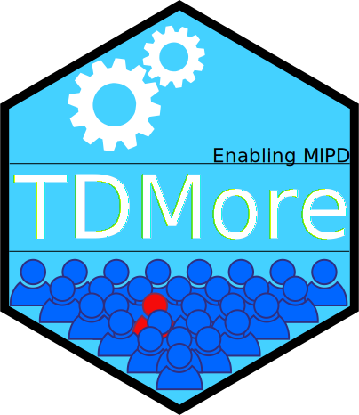

---
output:
  github_document:
    html_preview: false
---

<div align="center">
<a href="https://travis-ci.com/tdmore-dev/tdmore">
    
</a>
<a href="https://codecov.io/gh/tdmore-dev/tdmore">
  
</a>
</div>

# tdmore 
 
## Overview
`tdmore` provides an easy interface for the execution of post-hoc bayesian estimation of parameter vectors of virtual individuals given a population model and for the in silico assessment of dose individualization strategies.

The package is intended to make it easy to define your own models and use them for in silico assessments and educational purposes.

## How to install
TDMore depends on package `RxODE`, which requires a working C and fortran compiler to work. Installation procedure can be found [here](https://github.com/nlmixrdevelopment/RxODE). Once `RxODE` installed, simply execute the following command in the R console:

```{r, eval=F}
devtools::install_github("tdmore-dev/tdmore")
```

## Legal
All work is under exclusive copyright by KULeuven and cannot be distributed or modified.
You are allowed to install this package for experimentation. Please <a href="mailto:ruben.faelens@kuleuven.be">contact the authors</a> to obtain a license to use this work in a commercial software, or for research.

This software is a research project, and cannot be considered as a medical device. It is not a substitute for clinical reasoning.

## How to use
This example code uses `nlmixr` to define the model. 
```{r, echo=FALSE}
set.seed(0)
knitr::opts_chunk$set(fig.path="docs/figures/") #set a nice path
```
```{r, message=FALSE, results='hide'}
library(nlmixr)
library(tdmore)

modelCode <- function(){
  ini({
    TVKA <- 3.7
    TVVc <- 61
    TVCL <- 3.7
    ECL ~ 0.0784 #OMEGA_CL, 28% SD
    EV1 ~ 0.0361 #OMEGA_V1, 19% SD
    EPS_PROP <- 0.23 # Proportional error, 23% SD
  })
  model({
    KA <- TVKA
    CL <- TVCL * exp(ECL)
    Vc <- TVVc * exp(EV1)
    
    d/dt(depot) = -KA*depot
    d/dt(center) = KA*depot - CL/Vc * center
    
    CONC = center / Vc
    CONC ~ prop(EPS_PROP)
  })
}
model <- nlmixr::nlmixrUI(modelCode) %>% tdmore()

regimen <- data.frame(
  TIME=seq(0, 7)*24,
  AMT=5 #5mg
)

observed <- data.frame(TIME=c(2, 24, 72), CONC=c(0.04, 0.02, 0.025))
ipred <- model %>% estimate(observed, regimen)
```

```{r readme_plot_ipred, fig.align='center', fig.height = 3, fig.width = 8}
plot(ipred)
```

```{r}
coef(ipred)
vcov(ipred)
```

## More information
Interested in TDMore and eager to learn more about it? 

* The [vignettes](https://tdmore-dev.github.io/tdmore/vignettes.html) are also great examples to start with.
* Full documentation is available in the [TDMore Book](https://tdmore-dev.github.io/tdmore/book/index.html).
