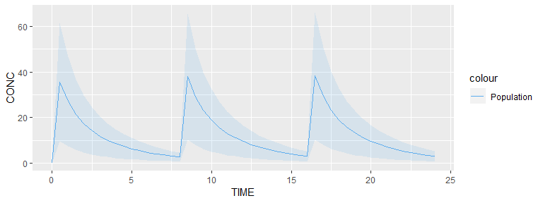
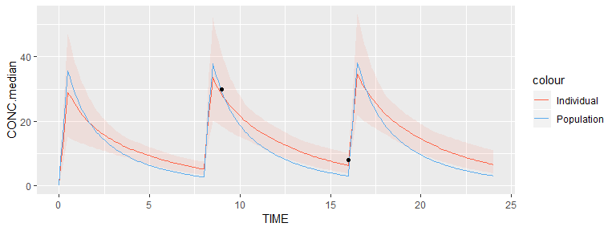
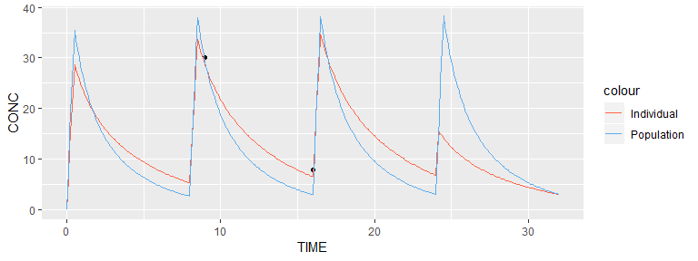

# What's TDMore?

TDMore is an R package that attemps to provide a global framework for making Therapeutic Drug Monitoring software. It is designed not only for the pharmacometricians but also for the physicians.

# Creating your model

There are several ways telling TDMore what your model is. The easiest way is to provide the model in the form of a nxlmir model. The following example shows how a 2-compartment-PK model can be written. For the purpose of this demonstration, the 'Meropenem' PK model will be used. As Meropenem is given by injection into a vein, the absorption compartment is omitted.


```r
library(nlmixr)

modelCode <- function(){
  ini({
    TVV1 <- 24.4;
    TVV2 <- 7.01;
    TVQ <- 4.97;
    TVCL <- 9.87;
    ECL ~ 0.194 # This value corresponds to OMEGA_CL (44% SD)
    EV1 ~ 0.287 # This value corresponds to OMEGA_V1 (54% SD)
    EPS_PROP <- 0.371 # Proportional error (37% SD)
  })
  model({
    CL <- TVCL * exp(ECL)
    V1 <- TVV1 * exp(EV1)
    V2 <- TVV2
    Q <- TVQ
    K12 <- Q/V1
    K21 <- Q/V2

    d/dt(center) = - CL/V1 * center - K12*center + K21 * periph
    d/dt(periph) = K12*center - K21 * periph

    CONC = center / V1
    CONC ~ prop(EPS_PROP) # Proportional error linked to the PK model
  })
}
```

Once the model is created, a TDMore object can be instantiated as follows:


```r
library(tdmore)

nlmixrUI <- nlmixrUI(modelCode)
tdmore <- tdmore(nlmixrUI)
```

The TDMore object is now ready for use.

# Predicting new data

TDMore can be used to run simulations, based on the model defined in the previous step. For doing so, the regimen first needs to be specified. In the case of Meropenem, an 30-min injection is given into the central compartment every 8 hour. This can be written as follows:


```r
regimen <- data.frame(
  TIME=c(0, 8, 16),            # Every 8 hour and for 1 day, an injection is given
  AMT=c(1000, 1000, 1000),     # 1g is administered
  RATE=c(1000, 1000, 1000)/0.5 # 30-minute infusion (rate=dose/infusion time)
)
```

Let's now simulate the population PK model for 1 day. This can be done using the TDMore predict() function. A dataframe with all the times to predict (and respective NA concentration) is given to the 'newdata' argument. Field 'se' is set to true, it tells TDMore we are interested to simulate the model with residual variability.


```r
data <- predict(
  object = tdmore,
  newdata = data.frame(TIME = seq(0, 24, by = 0.5), CONC = NA),
  regimen = regimen,
  se = TRUE
  )
  
library(ggplot2)
ggplot(data, aes(x=TIME, y=CONC)) +
  geom_ribbon(aes(fill="Population", ymin=CONC.lower, ymax=CONC.upper), fill="steelblue2", alpha=0.15) +
  geom_line(aes(color="Population"), data=data) +
  scale_color_manual(values=c("steelblue2"))
```



The plot above shows the median of the population (typical profile) and its 95% confidence interval. The range of the confidence interval can be changed using the argument 'level'.

# Estimating individual parameters

This section will show you how the individual parameters can be estimated, based on some observed data. Let's first estimate the parameters of a typical individual. This is achieved by calling the estimate() function.


```r
pred <- estimate(tdmore = tdmore, regimen = regimen)
coef(pred)
```

```
## ECL EV1 
##   0   0
```

Both eta's ECL and EV1 have been estimated to 0. This is not surprising, as zero eta's best describe the population average. We can also look at the uncertainty on these estimates.


```r
vcov(pred)
```

```
##              ECL          EV1
## ECL 1.940000e-01 1.090438e-13
## EV1 1.090438e-13 2.870000e-01
```

This uncertainty is equal to the population inter-individual variability (OMEGA matrix). Now, let's assume blood samples have been collected for a subject X at different times. For example, blood samples were collected at times 9h and 16h on the first day. This can be translated in TDMore as follows (note that the concentrations are purely fictive):


```r
observed <- data.frame(TIME=c(9, 16), CONC=c(30, 8))
```

We can ask TDMore to re-estimate the parameters for this specific individual:


```r
ipred <- estimate(tdmore = tdmore, observed = observed, regimen = regimen)
coef(ipred)
```

```
##        ECL        EV1 
## -0.2586462  0.2624485
```

Eta's obtained by calling 'coef' on pred maximise altogether the likelihood for this specific subject. The variance-covariance matrix shows the uncertainty of the individual estimates, and their correlation.


```r
vcov(ipred)
```

```
##            ECL        EV1
## ECL 0.03173634 0.03653847
## EV1 0.03653847 0.12738851
```

Predictions for the population (pred) and this specific subject (ipred) can be compared using the following snippet: 


```r
data <- predict(ipred, newdata=data.frame(TIME=seq(0, 24, 0.1), CONC=NA), se=TRUE)
ggplot(data, aes(x=TIME))  +
  geom_line(aes(color="Individual", y=CONC.median)) +
  geom_ribbon(aes(fill="Individual", ymin=CONC.lower, ymax=CONC.upper), fill="tomato1", alpha=0.10) +
  geom_line(aes(color="Population", y=CONC), data=predict(pred, newdata=seq(0, 24, 0.1))) +
  geom_point(aes(y=CONC), data=observed) +
  scale_color_manual(values=c("tomato1", "steelblue2"))
```



Ipred and pred are shown respectively in red and blue. A 95% confidence interval has been added around the ipred prediction. Note that the default TDMore plotting function can also be used to obtain the exact same plot in a single line of code:


```r
plot(ipred, newdata=data.frame(TIME=seq(0, 24, by=0.1), CONC=NA))
```

# Finding the right dose to give

A very interesting feature in TDMore is the possibility to ask the framework the next dose to be given knowing all the previous observations that were collected and some known end-points. For example, assume we still collected the same two observations on the first day, we would like to find the best first dose to be given on the second day. We would like to reach the trough concentration of 3.10 mg/L as much as possible. This can be expressed, as follows:


```r
newRegimen <- data.frame(
  TIME=c(0, 8, 16, 24),              # A fourth dose on the second day is added
  AMT=c(1000, 1000, 1000, NA),       # Adding an unknown dose on the second day
  RATE=c(1000, 1000, 1000, 1000)/0.5 # 30-minute infusion (rate=dose/infusion time)
)

recommendation <- findDose(
  ipred,
  regimen = newRegimen,
  interval = c(100, 5000),
  target = data.frame(TIME = 32, CONC = 3.1)
  )
summary(recommendation)
```

```
## $dose
## [1] 296.6246
## 
## $regimen
##   TIME       AMT RATE
## 1    0 1000.0000 2000
## 2    8 1000.0000 2000
## 3   16 1000.0000 2000
## 4   24  296.6246 2000
```

The result of the findDose() routine is shown above. It tells us that 300 mg (approximately) is the recommended starting dose on the second day. The following code helps up verify this visually.


```r
# Recommended regimen for individual can be directly accessed from the recommendation object
ipredRecommendedRegimen <- recommendation$regimen

# Population regimen can be updated using the 'updateRegimen' method, a 4th dose of 1000 is used
predUpdatedRegimen <- updateRegimen(regimen = newRegimen, newDose = 1000)
print(predUpdatedRegimen) # Check pred regimen
```

```
##   TIME  AMT RATE
## 1    0 1000 2000
## 2    8 1000 2000
## 3   16 1000 2000
## 4   24 1000 2000
```


```r
ipred <- estimate(tdmore = tdmore, observed = observed, regimen = ipredRecommendedRegimen)
pred <- estimate(tdmore = tdmore, regimen = predUpdatedRegimen)
```


```r
ggplot(observed, aes(x=TIME, y=CONC)) + geom_point() +
  geom_line(aes(color="Individual"), data=predict(ipred, newdata=seq(0, 32, by=0.1))) +
  geom_line(aes(color="Population"), data=predict(pred, newdata=seq(0, 32, by=0.1))) +
  scale_color_manual(values=c("tomato1", "steelblue2"))
```



The plot above demonstrates that the individual is reaching the trough concentration quite well after the first administration on the second day. 
